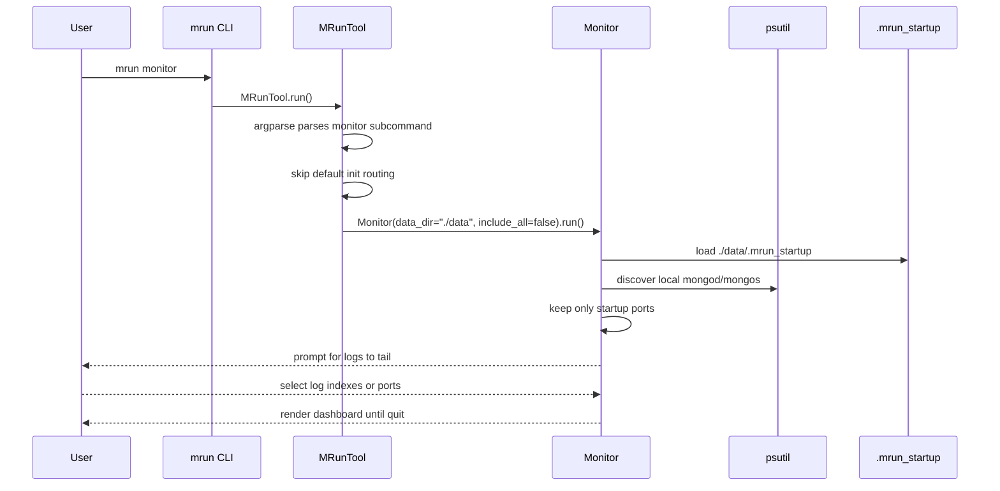
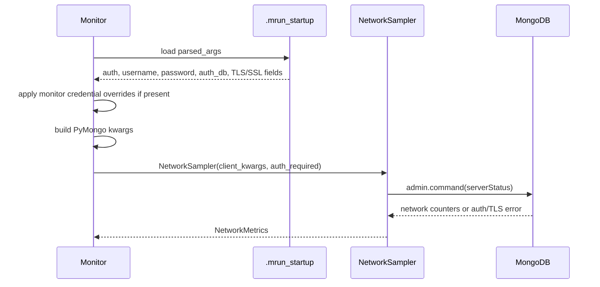
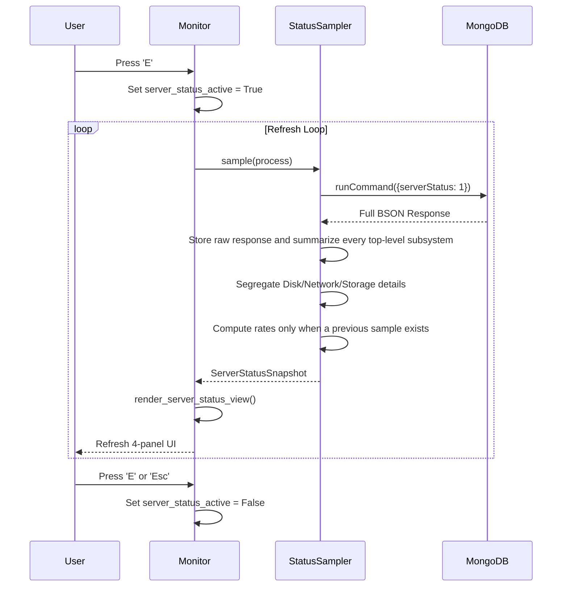
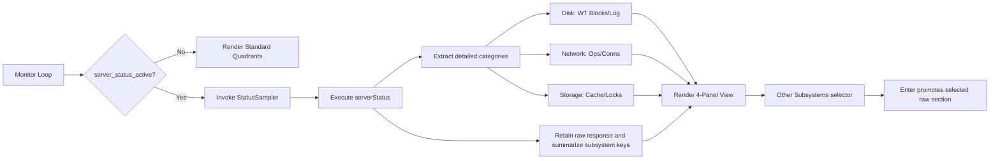
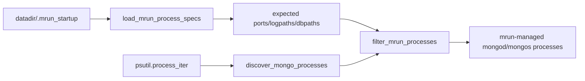
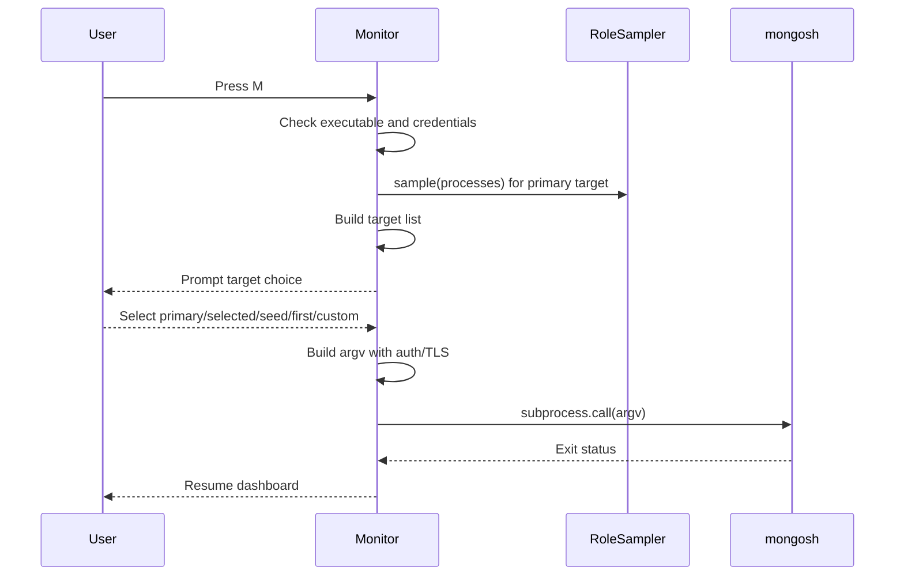
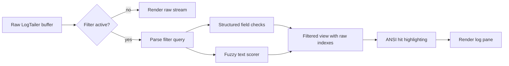
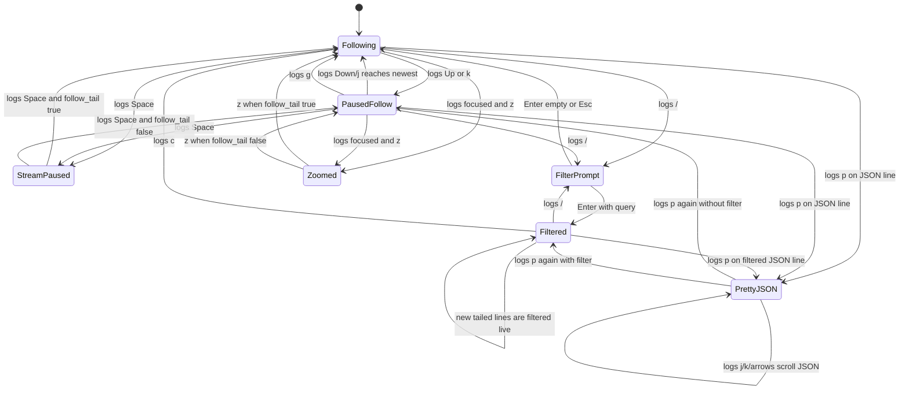

# feature-monitor branch guide

This document describes the monitor feature work introduced on the
`feature-monitor` branch. It is intended for reviewers, maintainers, and users
who want to understand how `mrun monitor` fits into the existing mongorun
architecture.

## Feature summary

The branch adds an interactive terminal monitor for MongoDB processes launched
by mongorun. The monitor is started with:

```bash
mrun monitor
```

By default, the monitor only displays MongoDB server processes that belong to
the current mongorun data directory, using `./data/.mrun_startup` unless
`--dir` is provided. This includes mrun-managed replica-set `mongod` nodes and
any mrun-managed `mongos` routers from the selected deployment, while keeping
unrelated local `mongod` and `mongos` processes out of the view.

To include every local MongoDB server process:

```bash
mrun monitor --all
```

The monitor shows:

- CPU usage by MongoDB process. The default CPU view is normalized so 100%
  means all logical CPUs on the host; the CPU pane `C` key toggles raw
  `psutil` CPU, which can exceed 100% on multi-core hosts.
- Replica-set role for each MongoDB process in CPU, memory, network, and disk
  metric panes.
- Sharded deployments grouped with `mongos`, `config server`, and shard section
  headers in CPU, memory, network, and disk metric panes.
- Memory usage by MongoDB process.
- MongoDB network counter rates from `serverStatus().network`.
- Disk consumption for each process dbpath and log file.
- Configurable top-N active cluster `currentOp` entries in the right-side
  activity pane. The default is 10 entries, and `L` changes the limit.
- CurrentOp source selection by process index, port, `primary`, `secondary`,
  or `all`, so only selected nodes receive `currentOp` commands.
- CurrentOp sampling pause/resume with Space while keeping the last sampled
  rows visible.
- Formatted and raw `db.currentOp()` display modes.
- CurrentOp namespace selection from active namespaces, with a clearable
  namespace filter.
- Pretty JSON and OSC 52 yank support for selected currentOp entries.
- Interactive `mongosh` administration shell handoff with primary,
  selected-node, seed-list, first-node, and custom-URI targets.
- Selectable live log tail with severity colors.
- Vim-style log filtering with fuzzy matching, structured field filters, and
  highlighted hits.
- Strict log and currentOp source selection prompts that accept visible
  indexes or displayed ports and re-prompt on invalid input.
- Focusable panes with full-pane zoom.
- Selectable CPU process rows.
- Optional CPU thread view for the selected process.
- Expanded server status view for Disk, Network, Storage, and all top-level
  `serverStatus()` subsystem summaries, with warm-up labels for rates that do
  not yet have a previous counter sample.
- Selectable serverStatus section browser in the expanded status view. Press
  `j`/`k` to select an undisplayed section and Enter to promote that section
  into the next metric pane, starting with the top-right pane.
- Zoomed log view.
- Scrollable syntax-colored Pretty JSON view for a highlighted log line.
- A two-column dashboard: CPU, Memory, Network, and Disk stacked on the left;
  Log Tail or Current Ops on the right.
- Neutral pane borders with bold, pane-colored titles and table headers.
- Shared ANSI-aware table formatting for CPU, memory, network, disk, and
  currentOp rows so column starts stay stable across panes.
- Log cursor movement that stays independent from the log viewport until the
  cursor reaches the visible window edge.
- Highlighted footer key names with explicit labels for `r logs`,
  `r op sources`, `scope:mrun`, `scope:all`, and the `a` scope action.
- All-process scope marks processes outside the selected mrun deployment and
  requires an explicit log path before tailing external process logs.
- Copy/yank support through OSC 52 terminal clipboard escape sequences.

No new terminal UI dependency is introduced. Rendering and keyboard input use
the Python standard library. The feature uses existing project dependencies and
interfaces such as `psutil` and the MongoDB client factory already used by
mongorun.

## Modified files

```text
feature-monitor branch
|
+-- mrun/mrun.py
|   +-- exposes monitor subcommand flags and routes monitor before normal dispatch
|   +-- updates monitor help text for logs-pane currentOp controls
|
+-- mrun/monitor.py
|   +-- implements process discovery, metrics sampling, log tailing, filtering, rendering, and key input
|   +-- distinguishes mrun-managed and external MongoDB processes
|   +-- adds role, currentOp, mongosh, and expanded serverStatus monitor flows
|   +-- retains raw serverStatus data for inspectable promoted subsystem panes
|   +-- displays rate warm-up state until counter deltas have a baseline
|   +-- clamps counter resets so derived rates never render as negative
|   +-- scopes currentOp toggling to the logs activity pane
|   +-- keeps table alignment, ANSI clipping, footer labels, and pane rendering stable
|
+-- mrun/test/test_monitor.py
|   +-- focused tests for monitor sampling, rendering, controls, prompts, and state transitions
|
+-- doc/mrun.rst
|   +-- user-facing monitor command documentation
|
+-- doc/monitor.md
|   +-- compact implementation note
|
+-- doc/feature-monitor-guide.md
    +-- this branch-level architecture and usage guide
```

## How the feature integrates

Before this branch, `MRunTool.run()` handled the normal command family:
`init`, `start`, `stop`, `restart`, `list`, and `kill`. This branch adds
`monitor` as a subcommand that bypasses the default `init` routing.

```text
existing flow

user command
    |
    v
MRunTool.run()
    |
    +--> parse command and flags
    |
    +--> normal subcommand dispatch
         |
         +--> init/start/stop/restart/list/kill


feature-monitor flow

user command
    |
    |  mrun monitor [--all] [--dir DIR]
    v
MRunTool.run()
    |
    +--> parse top-level monitor flags
    |
    +--> validate monitor-only arguments
    |
    +--> MRunTool.monitor()
         |
         +--> Monitor(...).run()
              |
              +--> interactive terminal dashboard
```

The integration is intentionally narrow:

- The existing subcommands continue to use their current code paths.
- `monitor` is treated as a separate subcommand.
- `--dir` is reused by monitor mode to find `.mrun_startup`.
- `--all` only affects monitor process discovery.
- `--monitor-username`, `--monitor-password`, and `--monitor-auth-db` only
  affect monitor network sampling.
- The monitor exits with status `1` when it cannot find matching processes and
  `0` for normal interactive exits.

## Invocation sequence



## All-process mode sequence


## Auth and TLS network sequence



## Runtime dashboard loop

The monitor refreshes once per configured interval. The default interval is
`1s`, and the `s` key cycles through `1s`, `5s`, and `10s`.

```mermaid
flowchart TD
    A[Start dashboard loop] --> B[Discover processes]
    B --> C{Processes found?}
    C -- no --> D[Print no-process message and exit]
    C -- yes --> E[Read CPU and memory]
    E --> ER[Sample serverStatus roles]
    ER --> F[Sample serverStatus network counters]
    F --> CO{CurrentOp view active?}
    CO -- yes --> CP[Sample active currentOps using top-N limit]
    CO -- no --> G[Read dbpath and log file sizes]
    CP --> G
    G --> H{Log streaming paused?}
    H -- yes --> I[Use existing log buffer]
    H -- no --> J[Poll selected log files]
    I --> K[Clamp highlighted log cursor]
    J --> K
    K --> L[Render terminal frame]
    L --> M{Key pressed?}
    M -- no --> A
    M -- q or Ctrl+C --> N[Exit]
    M -- log r --> O[Reselect logs by index or displayed port]
    M -- a --> P[Toggle process scope and reselect logs]
    M -- Tab or Shift+Tab --> Q[Move pane focus]
    M -- z --> R[Toggle focused-pane zoom]
    M -- CPU arrows/j/k --> S[Select MongoDB process]
    M -- CPU t --> T[Toggle selected-process thread view]
    M -- log pane o --> TO[Toggle log activity currentOp view]
    M -- currentOp L --> CL[Select currentOp top-N limit]
    M -- currentOp r --> CS[Select currentOp source nodes]
    M -- currentOp space --> CZ[Pause or resume currentOp sampling]
    M -- logs arrows/j/k --> U[Move highlighted line]
    M -- logs g --> V[Jump to newest line]
    M -- logs p --> W[Toggle pretty JSON]
    M -- logs y --> X[Yank highlighted raw line]
    M -- logs space --> Y[Pause or resume log/currentOp streaming]
    M -- E --> SS[Toggle expanded server status view]
    M -- status j/k --> SV[Select undisplayed serverStatus section]
    M -- status Enter --> SP[Promote selected section into next status pane]
    M -- M --> MS[Launch mongosh shell and return]
    M -- s --> Z[Cycle refresh interval]
    O --> A
    P --> A
    Q --> A
    R --> A
    S --> A
    T --> A
    TO --> A
    SV --> A
    SP --> A
    CL --> A
    CS --> A
    CZ --> A
    U --> A
    V --> A
    W --> A
    X --> A
    Y --> A
    MS --> A
    Z --> A

Implementation mapping for the dashboard loop:

- **Loop Start**: `Monitor._run_dashboard()`
- **Dashboard Snapshot**: `Monitor._read_dashboard_snapshot()`
- **Discover Processes**: `Monitor._discover_processes_or_report()`
- **Read CPU/Memory**: `ProcessSampler.sample()`
- **Sample Roles**: `RoleSampler.sample()`
- **Sample Current Ops**: `CurrentOpSampler.sample()`
- **Sample Network**: `NetworkSampler.sample()`
- **Read Disk Sizes**: `read_disk_metrics()`
- **Poll Logs**: `LogTailer.poll()`
- **Render Frame**: `render_dashboard()`
- **Two-Column Layout**: `_split_heights()` and `render_dashboard()`
- **Key Actions**: `Monitor._wait_for_action()`
- **Pane Focus**: `Monitor._focus_next_pane()`
- **Zoom Pane**: `Monitor._toggle_focused_zoom()`
- **CPU Normalized Toggle**: `Monitor._toggle_cpu_normalization()`
- **CPU Thread View**: `Monitor._toggle_cpu_thread_view()`
- **Log Activity CurrentOp View**: `Monitor._toggle_log_current_op_view()`
- **CurrentOp Raw Toggle**: `Monitor._toggle_current_op_raw()`
- **CurrentOp Namespace Selector**: `Monitor._select_current_op_namespace()`
- **CurrentOp Limit Selector**: `Monitor._select_current_op_limit()`
- **CurrentOp Source Selector**: `Monitor._select_current_op_sources()`
- **CurrentOp Pause Toggle**: `Monitor._toggle_current_op_sampling()`
- **Mongosh Shell Handoff**: `Monitor._launch_mongosh_admin_shell()`
- **Log Filter Prompt**: `Monitor._start_log_filter_prompt()`
- **Pretty Log JSON**: `Monitor._toggle_pretty_log_line()`
- **Pretty CurrentOp JSON**: `Monitor._toggle_pretty_current_op()`
- **Yank Log**: `Monitor._yank_log_line()`
- **Yank CurrentOp**: `Monitor._yank_current_op()`
- **Expanded Status**: `Monitor._toggle_server_status_view()`
```

## Terminal layout

The monitor renders one full terminal frame plus a one-line footer. In the
normal dashboard, the left half is a stacked metrics column and the right half
is a tall activity pane. The activity pane displays the log tail by default and
switches to top active `currentOp` rows when `o` is pressed.

```text
+ CPU Usage -------------------------++ Log Tail: 27017, 27018 --------------+
| PORT PID ROLE PROCESS CPU% STATUS  || 27017 | {"s":"I", ...}               |
| 27017 123 Primary mongod 12 running || 27018 | {"s":"W", ...}               |
+ Memory Usage ----------------------+|>27018 | {"s":"E", ...}               |
| PORT ROLE PID PROCESS RSS          || 27017 | {"s":"I", ...}               |
| 27017 Primary 123 mongod 1.2G      || 27018 | {"s":"D", ...}               |
+ Network Usage ---------------------+|                                       |
| PORT ROLE IN OUT REQ/s STATUS      ||                                       |
| 27017 Primary 1.5K/s 4.0K/s 12 ok  ||                                       |
+ Disk Usage ------------------------+|                                       |
| PORT ROLE DB SIZE LOG SIZE STATUS  ||                                       |
| 27017 Primary 540.2MB 12.1MB ok    ||                                       |
+------------------------------------++---------------------------------------+
q | Tab | z zoom | r | E | mrun | a all | s1s | logs j/k | ...
```

For sharded deployments, the metric panes keep the same columns but insert
section headers derived from `.mrun_startup`, matching the order used by
`mrun list`: `mongos`, `config server`, then each shard name.

```text
+ CPU Usage -------------------------++ Log Tail: 27017, 27018 --------------+
| PORT PID ROLE PROCESS CPU% STATUS  || 27017 | {"s":"I", ...}               |
| mongos                             || 27018 | {"s":"W", ...}               |
| 27017 30545 Router mongos 2 running||                                       |
| config server                      ||                                       |
| 27027 30520 Primary mongod 4 runn  ||                                       |
| shard01                            ||                                       |
| 27018 30466 Primary mongod 8 runn  ||                                       |
+------------------------------------++---------------------------------------+
```

### Highlighting and color coding

The monitor uses visual cues to indicate focus and severity:

- **Pane focus**: The currently focused pane is indicated by square brackets in
  the title and an emphasized ASCII border character. Borders remain neutral so
  structure stays low key.
- **Panel borders**: Borders are plain terminal foreground color. They do not
  carry pane colors.
- **Pane header color coding**: Titles and table headers use the pane color:
  - **CPU Usage**: Teal
  - **Memory Usage**: Green
  - **Network Usage**: Yellow
  - **Disk Usage**: Red
  - **Log Tail**: Teal
- **Table header styling**: Table header rows are bold and use the same color
  as their pane title. Body rows keep role, severity, selection, or yank
  styling where applicable.
- **Role styling**: `Primary`, `Secondary`, and `Password Required` use muted,
  non-bold role colors. They intentionally do not reuse the bold pane-header
  styling, so role values remain readable without competing with headers.
  Roles are rendered in CPU, memory, network, disk, and currentOp rows.
- **Internal padding and tables**: Non-empty content rows receive one cell of
  left padding after the border. CPU, memory, network, disk, and currentOp rows
  are formatted by the same ANSI-aware table helper, so column starts stay
  stable even when role text or JSON syntax colors are present.
- **Log severity**: MongoDB log lines are colored by severity (Fatal: red
  inverse, Error: red, Warning: yellow, Info: teal, Debug: dim gray).

```text
+ [CPU Usage] ==================++ Log Tail: 27017, 27018 -------+
|   PORT PID ROLE PROCESS CPU%   ||  27017 | {"s":"I", ...}       |
| > 27017 123 Primary mongod 12  ||  27018 | {"s":"W", ...}       |
+===============================+|> 27018 | {"s":"E", ...}       |
| Memory, Network, Disk stacked ||  27017 | {"s":"I", ...}       |
+-------------------------------++-------------------------------+
q | Tab | z zoom | r | E | mrun | a all | s1s | logs j/k | ...
```

When zoom mode is active, the focused pane owns the full frame. For logs:

```text
+ [Log Tail: 27018] ==============================================+
|  27018 | {"s":"I","msg":"startup complete"}                     |
|  27018 | {"s":"W","msg":"slow operation"}                       |
|> 27018 | {"s":"E","msg":"connection failed"}                    |
|  27018 | {"s":"I","msg":"listening"}                            |
+=================================================================+
```

CPU thread view is toggled only from the CPU pane with `t`:

```text
+ [CPU Threads: port 27017 pid 12345] ============================+
| PROCESS port 27017 pid 12345 mongod                             |
| TID        CPU%    USER     SYSTEM   TOTAL                       |
| 456789      12.5   2.10     0.30     2.40                        |
+=================================================================+
```

Top currentOp view is toggled with `o`. It uses the right activity pane,
leaves the left metric panes visible, and defaults to the top 10 active
operations:

```text
+ CPU Usage --------------------++ [Current Ops (Formatted, top 10)] --------+
| PORT PID ROLE PROCESS CPU%    || PORT   ROLE              SECS OP    NS    |
| 27017 123 Primary mongod 12   ||>27017  Primary             8.4 query app  |
+ Memory Usage -----------------+| 27018  Secondary           4.2 command   |
+ Network Usage ----------------+|                                       |
+ Disk Usage -------------------++---------------------------------------+
```

Press `O` while this view is active to switch the right activity pane to raw
documents derived from the `db.currentOp()` command response. BSON-only values
such as `ObjectId`, `Timestamp`, and datetimes are converted to safe text for
terminal display instead of being passed directly to `json.dumps()`.

```text
+ CPU Usage --------------------++ [Current Ops (Raw, top 10)] --------------+
| PORT PID ROLE PROCESS CPU%    || RAW CURRENTOP DOCUMENTS                  |
| 27017 123 Primary mongod 12   ||>27017 Primary {"op":"query","ns":"app"}  |
+-------------------------------++------------------------------------------+
```

CurrentOp rows can be navigated with `j`/`k` or arrows while the right activity
pane is active. Press `n` while currentOp is active to choose a namespace from
the active currentOp namespaces, or type a namespace manually. Press `c` while
currentOp is active to clear that namespace filter. Press `p` on a highlighted
currentOp row to show the BSON-safe raw document as syntax-colored Pretty JSON;
`j`/`k` then scroll that pretty document. Press `p` again to return to the
currentOp list. Press `y` to yank the highlighted currentOp through OSC 52.
Press `L` while currentOp is active to set the top-N limit; the prompt accepts
positive integers and caps large values at 500.

Pretty JSON mode also uses the full log view:

```text
+ Log Tail: 27018 (Pretty JSON) ---------------------------------+
| {                                                               |
|   "t": {                                                        |
|     "$date": "2026-05-05T13:30:29.241-07:00"                   |
|   },                                                            |
|   "s": "I",                                                     |
|   "c": "NETWORK",                                               |
|   "msg": "connection accepted"                                  |
| }                                                               |
+-----------------------------------------------------------------+
```

## Panel rendering and header styling

The terminal frame is rendered without a UI framework. `make_panel()` is the
single panel primitive used by the dashboard, focused zoom panes, Pretty JSON
views, and the expanded `serverStatus()` layout. The helper is deliberately
ANSI-aware so color codes do not change visible widths or push borders out of
alignment.

```text
---------------- render_dashboard() ----------------+
| split terminal into left metrics and right activity|
|                                                    |
|  +--> make_panel("CPU Usage", cpu_lines, ...)      |
|  +--> make_panel("Memory Usage", memory_lines, ...)|
|  +--> make_panel("Network Usage", network_lines,..)|
|  +--> make_panel("Disk Usage", disk_lines, ...)    |
|  +--> make_panel("Log Tail" or "Current Ops", ...) |
+----------------------------------------------------+
               |
               v
+---------------- make_panel() ----------------------+
| title row: ANSI_BOLD + pane color + title          |
| border row: neutral terminal foreground            |
| content: add one-cell padding after left border    |
| header: STYLE_TABLE_HEADER -> bold + pane color    |
| width: _truncate_ansi() + _pad_ansi()              |
+----------------------------------------------------+
```

Table header rows are marked before rendering. The metric and currentOp
formatters build rows through `format_table_lines()`, which accepts column
definitions, computes visible widths with ANSI/style markers removed, and then
right- or left-aligns each cell. Header rows carry a private
`STYLE_TABLE_HEADER` marker. `make_panel()` strips that marker, applies bold and
the pane's header color, then pads and clips the visible text to the panel
width.

```text
format_cpu_lines()
    |
    +-- format_table_lines([PORT, PID, ROLE, PROCESS, CPU%, STATUS], rows)
    |
    +-- _table_header("  PORT   PID ...")
    |
    v
make_panel(header_color=ANSI_TEAL)
    |
    +-- _style_ansi([STYLE_TABLE_HEADER], header_color)
    |
    v
bold teal table header inside a teal CPU pane
```

Implementation mapping for panel rendering:

- **Bold Escape Constant**: `ANSI_BOLD`
- **Table Header Marker**: `STYLE_TABLE_HEADER`
- **Role Color Constants**: `ANSI_ROLE_PRIMARY`, `ANSI_ROLE_SECONDARY`, and `ANSI_ROLE_WARNING`
- **Panel Content Padding**: `_panel_content_padding()`
- **Table Header Wrapper**: `_table_header()`
- **Style to ANSI Conversion**: `_style_ansi()`
- **Role Color Helpers**: `role_style()`, `colorize_role()`, and `format_role()`
- **Panel Renderer**: `make_panel()`
- **Shared Table Formatter**: `format_table_lines()`
- **CPU Header Source**: `format_cpu_lines()`
- **CurrentOp Header Source**: `format_current_op_lines()`
- **Memory Header Source**: `format_memory_lines()`
- **Network Header Source**: `format_network_lines()`
- **Disk Header Source**: `format_disk_lines()`
- **Subsystem Header Source**: `format_subsystem_status_lines()`
- **Thread Header Source**: `format_thread_lines()`
- **Renderer Regression Test**: `test_make_panel_bolds_title_and_pads_table_header()`
- **Neutral Border Regression Test**: `test_make_panel_uses_neutral_borders_and_colored_header_text()`

## Expanded Server Status View

The expanded status view is triggered by `E` and provides a deeper view into
the internals of the selected MongoDB process. It replaces the standard
dashboard with a four-panel `serverStatus()` layout. The first sample from a
node is used as the counter baseline; rate fields show `warming up` until a
second sample establishes a real elapsed window.

### Layout segregation

| Category | Source Metrics | Key Data Points |
| :--- | :--- | :--- |
| **Disk** | `wiredTiger.block-manager`, `wiredTiger.log`, `backgroundFlushing` | Read/Write rates, Log size, Flush durations |
| **Network** | `network`, `connections`, `opcounters` | Active connections, Op rates (ops/sec), Network IO |
| **Storage** | `wiredTiger.cache`, `concurrentTransactions`, `globalLock`, `mem` | Cache usage (%), Read/Write tickets, Lock queues, RSS |
| **Other Subsystems** | all top-level `serverStatus()` keys not already expanded | selectable key name and compact summary, including `metrics`, `locks`, `repl`, `flowControl`, `security`, and any version-specific fields |

The other-subsystems panel intentionally starts with compact summaries instead
of dumping the entire BSON response. This keeps the terminal readable while
still making it clear which MongoDB subsystem sections are present for the
selected node. Press `j`/`k` or the arrow keys to move through the list and
press Enter to promote the selected section into the next metric pane. The
first promotion target is the top-right pane, then the bottom-left pane, then
the top-left pane. The selector remains anchored in the bottom-right pane so it
is always available for the next promotion. The displaced pane becomes a
selectable item in the other-subsystems list.

### Accuracy model

`serverStatus()` exposes a mix of absolute counters, instantaneous gauges, and
rate-like data that must be derived by comparing two counter samples. The
expanded status sampler keeps the raw response, the sample timestamp, and the
elapsed interval used for rate calculations. Disk and network rates are not
rendered as `0` on the first sample anymore; the UI shows `warming up` until a
previous sample exists. Counter resets, such as a server restart between
samples, are clamped to `0` instead of displaying negative rates.

The promoted raw-section panes render the current value from the latest
`serverStatus()` response. That makes version-specific sections inspectable
without guessing which MongoDB release exposes which fields.

### Status sequence



### ASCII Layout (Expanded View)

```text
+ [DISK STATUS] (port 27017) ----------+ [NETWORK STATUS] (port 27017) ------+
| WT Block Manager:                    | Connections:                       |
|  Rate Window: 1.0s                   |  Current:   15                     |
|  Read:    1.2 MB/s                   | Op Rates (ops/sec):                |
|  Written: 0.5 MB/s                   |  Query:   450.5                    |
| WT Logging:                          | Network Rates:                     |
+--------------------------------------+------------------------------------+
+ [STORAGE SUBSYSTEM] (port 27017) ----+ [OTHER SUBSYSTEMS] (port 27017) ---+
| WT Cache:                            | Undisplayed serverStatus sections: |
|  Used: [####------] 42%              | SECTION                SUMMARY     |
| WT Tickets (available):              | version:               8.0.0       |
|  Read:  128                          |>metrics:              18 fields    |
| Memory:                              | locks:                 5 fields    |
+--------------------------------------+------------------------------------+
E exit | status j/k | Enter promote | r reset | target:top-right | s 1s | q quit
```

Implementation mapping for expanded status view:

- **Status Snapshot Model**: `ServerStatusSnapshot`
- **Status Sampler**: `StatusSampler.sample()`
- **Subsystem Summaries**: `StatusSampler._extract_subsystems()`
- **Disk Formatting**: `format_disk_status_lines()`
- **Network Formatting**: `format_network_status_lines()`
- **Storage Formatting**: `format_storage_status_lines()`
- **Other Subsystems Formatting**: `format_subsystem_status_lines()`
- **Raw Subsystem Formatting**: `format_server_status_detail_lines()`
- **Selectable Status Sections**: `status_selectable_panels()`
- **Status Promotion Handling**: `Monitor._promote_status_subsystem()`
- **Four-Panel Renderer**: `render_server_status_view()`
- **Neutral Border Rendering**: `make_panel()`
- **Toggle Handling**: `Monitor._toggle_server_status_view()`

### Logical flow



## Process discovery

The monitor has two process scopes.

### mrun-managed scope

This is the default for `mrun monitor`.

```text
data directory
    |
    +-- .mrun_startup
          |
          +-- startup_info
                |
                +-- port -> original mongod/mongos command line
```

`mrun/monitor.py` loads the startup file and extracts expected process names,
ports, dbpaths, logpaths, and replica-set names. It then discovers running
MongoDB processes using `psutil` and keeps only processes whose command-line
metadata matches the startup metadata. Port alone is not enough: a matching
mrun process must also agree on process type and dbpath or logpath, and
replica-set `mongod` nodes must agree on `--replSet`.

When `.mrun_startup` describes a sharded deployment, monitor discovery also
assigns process groups. The dashboard uses those groups to render sharded
section headers in the metric panes while non-sharded deployments keep the
compact default tables.



### All-process scope

This mode is started with `mrun monitor --all` or by pressing `a` inside the
monitor. It skips `.mrun_startup` filtering and shows every local `mongod` or
`mongos` visible to `psutil`.

This is useful for debugging manually launched nodes, but the default remains
mrun-managed to reduce terminal noise. In all-process scope, mrun-managed
processes retain their stored log metadata. Processes outside the selected
mrun deployment are visible in the metrics panes but are marked as external and
their logs are not tailed automatically.

## Replica roles and activity-pane currentOp view

The CPU, memory, network, disk, and currentOp rows include a `ROLE` column.
The role is sampled from each node through `serverStatus()` using the same
direct per-port client path as the network and expanded status samplers. If a
supported MongoDB version does not expose enough role data in `serverStatus()`,
the sampler falls back to `hello`, then legacy `isMaster`, before marking the
role unavailable.

```mermaid
sequenceDiagram
    participant Loop as Dashboard Loop
    participant Role as RoleSampler
    participant Op as CurrentOpSampler
    participant Mongo as MongoDB Node

    Loop->>Role: sample(processes)
    Role->>Mongo: admin.command(serverStatus)
    Mongo-->>Role: repl.stateStr or repl.isWritablePrimary
    opt serverStatus lacks role or is rejected
        Role->>Mongo: admin.command(hello), then isMaster
        Mongo-->>Role: isWritablePrimary/ismaster/secondary/msg
    end
    Role-->>Loop: RoleMetrics by port
    alt activity-pane currentOp view active
        Loop->>Op: sample(processes, role_metrics, limit, namespace)
        Op->>Mongo: admin.command({currentOp:1,$all:true,active:true,ns?})
        opt optional currentOp field rejected
            Op->>Mongo: retry simpler currentOp shapes
        end
        Mongo-->>Op: inprog active operations
        Op-->>Loop: top-N entries sorted by secs_running
    end
```

Role extraction rules:

```text
serverStatus().repl.stateStr == PRIMARY    -> Primary
serverStatus().repl.stateStr == SECONDARY  -> Secondary
repl.isWritablePrimary == true             -> Primary
repl.isWritablePrimary == false with repl   -> Secondary
hello.isWritablePrimary == true            -> Primary
hello.ismaster == true                     -> Primary
hello.secondary == true                    -> Secondary
process == mongos                          -> Router
no repl data                               -> Standalone
auth metadata without credentials          -> Password Required
```

The `Password Required` role text is intentionally different from the network
panel's lower-level `auth required` status. The role column is a user
navigation surface, so it uses the clearer instruction-like text. When monitor
credentials are available from `.mrun_startup` or explicit
`--monitor-username`, `--monitor-password`, and `--monitor-auth-db` flags, the
same credentials are passed to role and currentOp sampling.

Role colors:

```text
Primary           -> muted non-bold green
Secondary         -> muted non-bold amber
Password Required -> muted non-bold warning red
unknown/unavailable -> dim or neutral
```

The currentOp view is not the default. Press `o` from the logs pane to replace
the right-side log activity pane with active currentOp entries across visible
processes. The default limit is top 10, and `L` opens a top-N selector while
currentOp is active. The selector accepts positive integers and caps large
values at 500. The left CPU, memory, network, and disk panes remain visible.
Press `O` while currentOp is active to toggle between formatted rows and raw
`db.currentOp()`-derived documents. Raw display is BSON-safe: values that are
not JSON serializable are converted to readable text before rendering. Press
`n` while currentOp is active to select a namespace filter from active
namespaces, or type a namespace manually; press `c` to clear the currentOp
namespace filter. The sampler prefers the richest command shape,
`{currentOp: 1, $all: true, active: true, ns?: ...}`, then retries simpler
forms if a supported MongoDB version rejects an optional field. The UI still
filters returned documents client-side when a namespace is active, so older or
newer command response shapes remain stable in the display. Press `p` on the
highlighted currentOp to open a scrollable syntax-colored Pretty JSON view of
its raw `db.currentOp()` document. Press `y` to yank either the visible
formatted row, raw JSON document, or active pretty JSON document depending on
the current currentOp mode.

Press `r` while currentOp is active to choose which nodes receive `currentOp`
commands. The selector accepts process indexes, ports, `primary`, `secondary`,
`all`, or Enter for all visible processes. For example, entering `primary`
filters currentOp sampling to the primary node only; secondaries remain visible
in the metric panes but are not queried for currentOp rows. Press Space while
currentOp is active to pause currentOp sampling. The monitor keeps rendering
the last sampled currentOp snapshot until Space is pressed again. Press `o`
again to return the right side to the log tail. The view is sampled only while
active, so normal dashboard refreshes do not run `currentOp` commands
unnecessarily.

Implementation mapping for roles and currentOp:

- **Role Snapshot Model**: `RoleMetrics`
- **Command Capability Model**: `MongoCommandCapabilities`
- **CurrentOp Entry Model**: `CurrentOpEntry`
- **CurrentOp Snapshot Model**: `CurrentOpSnapshot`
- **Compatibility Error Mapping**: `_compat_error_message()`
- **Role Sampler**: `RoleSampler.sample()`
- **Role Extraction**: `role_from_server_status()`
- **Hello Role Fallback**: `read_hello_role()`
- **Role Formatting**: `format_role()`
- **CurrentOp Sampler**: `CurrentOpSampler.sample()`
- **CurrentOp Command Fallbacks**: `current_op_command_candidates()`
- **CurrentOp Result Extraction**: `current_op_documents()`
- **CurrentOp Normalization**: `current_op_entry()`
- **CurrentOp Namespace List**: `current_op_namespaces()`
- **BSON-Safe Raw Rendering**: `current_op_raw_json()`
- **Pretty CurrentOp JSON**: `current_op_pretty_json_lines()`
- **Limit Prompt Parser**: `parse_current_op_limit_selection()`
- **Limit Prompt**: `choose_current_op_limit()`
- **Source Label**: `current_op_source_label()`
- **Source Prompt Parser**: `parse_current_op_source_selection()`
- **Source Prompt**: `choose_current_op_sources()`
- **Namespace Prompt Parser**: `parse_current_op_namespace_selection()`
- **Namespace Prompt**: `choose_current_op_namespace()`
- **Shared Table Formatter**: `format_table_lines()`
- **CPU Role Rendering**: `format_cpu_lines()`
- **Memory Role Rendering**: `format_memory_lines()`
- **Network Role Rendering**: `format_network_lines()`
- **Disk Role Rendering**: `format_disk_lines()`
- **CurrentOp Rendering**: `format_current_op_lines()`
- **Log Activity CurrentOp Toggle**: `Monitor._toggle_log_current_op_view()`
- **Raw CurrentOp Toggle**: `Monitor._toggle_current_op_raw()`
- **CurrentOp Limit Selector**: `Monitor._select_current_op_limit()`
- **CurrentOp Source Selector**: `Monitor._select_current_op_sources()`
- **CurrentOp Pause Toggle**: `Monitor._toggle_current_op_sampling()`
- **Pretty CurrentOp Toggle**: `Monitor._toggle_pretty_current_op()`
- **CurrentOp Yank**: `Monitor._yank_current_op()`

## Mongosh administration shell handoff

The monitor can hand control to `mongosh` without terminating the dashboard.
Press `M` from the dashboard to open a target selector, choose where to connect,
administer the cluster in `mongosh`, and exit the shell to return to the live
monitor.

```text
monitor dashboard
    |
    |  M
    v
target prompt
    |
    +-- primary node, when role sampling identifies one
    +-- selected CPU row
    +-- replica-set seed list from visible processes
    +-- first visible process
    +-- custom URI typed by the user
    |
    v
subprocess argv, no shell=True
    |
    v
mongosh uses inherited terminal stdio
    |
    v
exit mongosh and resume dashboard
```

Authentication and TLS handling matches monitor sampling:

- The monitor loads auth/TLS metadata from `.mrun_startup`.
- `--monitor-username`, `--monitor-password`, and `--monitor-auth-db` override
  stored auth only for monitor-related operations.
- TLS flags such as `--tls`, `--tlsCAFile`, client certificate files, CRL files,
  and invalid certificate/hostname allowances are translated from the stored
  client kwargs.
- Password values are never appended to the command argv. The generated command
  passes `--password` without a value, so `mongosh` prompts securely.
- If auth metadata says credentials are required but monitor has none, the
  handoff refuses to launch and reports `mongosh requires credentials for this
  deployment`.
- If `mongosh` is not on `PATH`, the dashboard reports `mongosh not found in
  PATH`.



Implementation mapping for mongosh handoff:

- **Replica Set Name Loader**: `load_monitor_replset_name()`
- **Target Model**: `MongoshTarget`
- **Target Builder**: `mongosh_target_options()`
- **Target Parser**: `parse_mongosh_target_selection()`
- **Target Prompt**: `choose_mongosh_target()`
- **TLS Flag Builder**: `mongosh_tls_args()`
- **Command Builder**: `build_mongosh_command()`
- **Dashboard Handoff**: `Monitor._launch_mongosh_admin_shell()`

## Metrics model

```text
MongoProcessInfo
|
+-- pid
+-- process name: mongod or mongos
+-- port
+-- logpath
+-- dbpath
+-- cmdline

ProcessMetrics
|
+-- cpu_percent
+-- memory_rss
+-- status

ProcessSampler
|
+-- cached psutil.Process by pid
+-- prime()
+-- sample()

ThreadMetrics
|
+-- thread_id
+-- cpu_percent
+-- user_time
+-- system_time
+-- total_time

RoleMetrics
|
+-- available
+-- role: Primary, Secondary, Router, Standalone, Password Required, or unavailable
+-- error

NetworkMetrics
|
+-- available
+-- bytes_in_per_sec
+-- bytes_out_per_sec
+-- requests_per_sec
+-- error

CurrentOpEntry
|
+-- port
+-- role
+-- secs_running
+-- op
+-- ns
+-- client
+-- desc/opid
+-- raw document for raw currentOp view

CurrentOpSnapshot
|
+-- available
+-- entries: top-N active operations sorted by secs_running
+-- error

CurrentOp limit
|
+-- default: 10
+-- maximum: 500
+-- L opens selector while currentOp view is active

CurrentOp source filter
|
+-- empty list means all visible MongoDB processes
+-- r opens selector while currentOp view is active
+-- accepts indexes, ports, primary, secondary, all, or Enter for all
+-- invalid source tokens or unseen ports are reported and re-prompted
+-- only selected source processes receive currentOp commands

CurrentOp sampling pause
|
+-- Space toggles pause/resume while currentOp view is active
+-- paused mode reuses the cached CurrentOpSnapshot
+-- resume clears the cache and samples again on the next refresh

CurrentOp namespace filter
|
+-- empty string means no namespace filter
+-- n opens selector from active currentOp namespaces
+-- c clears the filter while currentOp view is active

MongoshTarget
|
+-- label
+-- uri
+-- kind: primary, selected, seed-list, first, or custom

MonitorAuthConfig
|
+-- enabled
+-- username
+-- password
+-- auth_db
+-- initial_user
+-- client_kwargs()
+-- requires_credentials()

DiskMetrics
|
+-- available
+-- db_size
+-- log_size
+-- error

LogFilterMatch
|
+-- matched
+-- score
+-- spans

LogFilterView
|
+-- filtered lines
+-- original raw-buffer indexes
+-- search-hit spans by raw index

ServerStatusSnapshot
|
+-- available
+-- port
+-- raw: latest full serverStatus response
+-- disk/network/storage detailed categories
+-- subsystems: compact top-level serverStatus summaries
+-- rate_ready/rate_elapsed for derived counter rates
+-- sampled_at
+-- error

DashboardSnapshot
|
+-- processes
+-- process_metrics
+-- role_metrics
+-- network_metrics
+-- disk_metrics
+-- log_lines
+-- thread_metrics/thread_error/thread_count
+-- current_ops
+-- status_snapshot
+-- sampled_at
```

CPU and memory come from `psutil.Process`. CPU percent is read through a
long-lived `ProcessSampler` that keeps one `psutil.Process` object per pid, so
`cpu_percent(interval=None)` has a previous sample to compare against on later
refreshes. This matters because recreating a `psutil.Process` for every
dashboard tick can repeatedly return an initial zero sample instead of the live
CPU rate. The sampler stores both the raw psutil process CPU and a normalized
CPU value. Normalized CPU divides the raw process CPU by the detected logical
CPU count, so 100% means the process consumed all logical CPUs available to the
host during the sampling interval. Raw mode remains available from the CPU pane
with `C` for troubleshooting because raw process CPU can exceed 100% on
multi-core hosts. Roles are read from `serverStatus().repl` and rendered in all
metric tables plus currentOp rows. Network rates are computed by sampling
MongoDB `serverStatus().network` counters and calculating deltas between
refreshes. For authenticated deployments, monitor mode loads stored
credentials from `.mrun_startup` and passes them to the network sampler. If
`--monitor-username`, `--monitor-password`, or `--monitor-auth-db` are provided,
those values override stored credentials for monitor network, role, currentOp,
and expanded status sampling only. TLS/SSL client options are also rehydrated
from `.mrun_startup` and passed to the same monitor client path. Disk size is
computed with standard library file traversal: `os.walk()` and
`os.path.getsize()`.

CurrentOp sampling is deliberately on-demand. It runs only while the right
activity pane is in currentOp view and merges active operations from the
visible MongoDB processes, sorted by `secs_running` descending and truncated to
the configured top-N limit. Formatted mode shows compact columns; raw mode
renders the original document captured by `CurrentOpEntry.raw` through a
BSON-safe serializer. If a namespace filter is active, the sampler first tries
to pass `ns` to the currentOp command, then retries without `ns` if the server
rejects that optional field. The returned operation documents are still
filtered client-side. The sampler also accepts common result containers such as
`inprog`, `ops`, and `currentOps`, which keeps the pane usable when supported
MongoDB versions vary response shape.

When a currentOp source filter is active, the monitor filters the process list
before calling `CurrentOpSampler.sample()`. Selecting `primary` means only the
current primary process is sampled for currentOp rows; the remaining nodes keep
their metric panes visible but do not receive currentOp commands. When currentOp
sampling is paused with Space, the monitor skips `CurrentOpSampler.sample()`
and renders the cached `CurrentOpSnapshot`.

The `M` shell handoff is also on-demand. It is not part of the refresh loop and
does not run unless the user explicitly requests it. The monitor temporarily
restores normal terminal handling, launches `mongosh` as an argv list, and then
redraws the dashboard after `mongosh` exits.

Expanded status mode reuses the same MongoDB client configuration and calls
`serverStatus()` for the selected CPU process. Detailed fields are split into
Disk, Network, and Storage panels, while every top-level response key is also
summarized in the Other Subsystems panel so version-specific subsystems are not
silently hidden. The raw response is retained in `ServerStatusSnapshot.raw`, so
selecting a hidden section and pressing Enter can stream that section's current
values in a promoted pane on later refreshes. Missing or non-dictionary
subsystem fields are treated as empty sections instead of crashing the
renderer, which lets the pane display cleanly across supported MongoDB
versions.

Thread metrics are sampled only when the CPU pane is in thread view. The
monitor reads `psutil.Process(pid).threads()` for the selected process and
computes per-thread CPU percentage from user/system time deltas between
refreshes. If the operating system denies detailed thread timing, the monitor
falls back to `psutil.Process(pid).num_threads()` and shows the thread count.

## Pane focus, CPU threads, and activity pane

The monitor starts with the logs pane focused, preserving the existing behavior
where log navigation works immediately after the dashboard opens.

```text
focus order

logs --Tab--> cpu --Tab--> memory --Tab--> network --Tab--> disk --Tab--> logs
logs --Shift+Tab--> disk
```

The focused pane receives an emphasized neutral ASCII border. `z` zooms the
focused pane, not only logs. When a zoomed pane is active, `z` returns to the
dashboard view.

CPU pane behavior:

```text
default CPU pane
    |
    |  j/k or arrows
    v
selected mongod/mongos row
    |
    |  C
    v
raw or normalized CPU mode
    |
    |  C
    v
selected mongod/mongos row
    |
    |  t
    v
thread view for selected process
    |
    |  t
    v
default CPU pane
```

Thread view is not rendered by default. It is a pane-local toggle, so log
tailing, memory, network, and disk views do not change unless their pane is
focused or zoomed.

CurrentOp view is also not rendered by default. It is toggled from the logs
pane with `o`, replacing the log tail in the right-side log activity pane.
The CPU pane keeps showing process CPU rows, so the left metric stack remains
visible:

```text
log activity pane
    |
    |  o
    v
top-N currentOp formatted view
    |
    |  O
    v
top-N currentOp raw view
    |
    |  L
    v
updated currentOp top-N limit
    |
    |  r
    v
selected currentOp source nodes
    |
    |  Space
    v
paused currentOp snapshot
    |
    |  o
    v
log activity pane
```

macOS may deny detailed per-thread timing through `task_for_pid`, even when the
monitor is launched with `sudo`. In that case the CPU thread pane displays the
available thread count and a short unavailable message:

```text
PROCESS port 27017 pid 86094 mongod
THREAD COUNT 113
thread details unavailable
```

## Fast cursor redraws

The dashboard samples process, network, disk, thread, and log data on the
configured refresh cadence. Cursor-only actions such as log up/down, CPU
process up/down, pane focus, and zoom redraw from the most recent
`DashboardSnapshot` instead of re-running all samplers.

```text
arrow key
    |
    v
update cursor state
    |
    v
render cached DashboardSnapshot
    |
    +-- no process discovery
    +-- no serverStatus network query
    +-- no disk walk
    +-- no log file poll until refresh deadline
```

When CPU thread view is active, changing the selected CPU process forces a
fresh sample so the thread count/details match the newly selected process.

Log cursor movement keeps a separate `log_view_start` value. When the cursor
moves within the visible log window, only the cursor marker moves and the text
does not scroll. Once the cursor reaches the top or bottom visible edge, the
viewport shifts by one row. `g` jumps the cursor and viewport back to the
newest filtered or unfiltered log line.

Implementation mapping for cursor-only redraw:

- **Log View Clamp**: `clamp_log_view_start()`
- **Log Row Formatting**: `format_log_lines()`
- **Activity Pane Height**: `Monitor._activity_view_height()`
- **Log Cursor Move**: `Monitor._move_log_cursor()`
- **Jump Latest**: `Monitor._jump_to_latest()`
- **Cursor Regression Test**: `test_log_cursor_moves_inside_visible_window_before_scrolling()`

## Log tailing

The log tailer keeps a bounded in-memory buffer. Each line is prefixed with the
MongoDB port so users can see which process produced it.

```text
raw file line
    |
    v
LogTailer._append_line(port, line)
    |
    v
"27018 | {\"s\":\"I\", ...}"
```

The initial seed reads a small recent tail from each selected log file without
scanning the whole file. Later refreshes poll from remembered file offsets.
When multiple replica-set logs are selected, the monitor sorts new MongoDB JSON
log lines by their parsed `t.$date` timestamp before rendering them.

External processes in all-process scope do not use any discovered `--logpath`
automatically. If a user explicitly selects an external process for log
streaming, the monitor prints `live tail log unavailable`, asks for a log path,
and tails that file only when the provided path exists. Blank or invalid paths
leave the process visible without log streaming.

```mermaid
sequenceDiagram
    participant Loop as Dashboard Loop
    participant Tailer as LogTailer
    participant File as MongoDB log file

    Loop->>Tailer: read_log_stream(stream_paused=false)
    Tailer->>File: seek saved offset
    File-->>Tailer: appended lines
    Tailer->>Tailer: prefix each line with port
    Tailer-->>Loop: bounded log buffer

    Loop->>Tailer: read_log_stream(stream_paused=true)
    Tailer-->>Loop: existing buffer without reading file
```

Pausing log streaming with Space while the logs pane is focused freezes the
visible buffer and does not advance file offsets. Resuming catches up from the
same offsets.

## Log filtering

Log filtering is entered from the logs pane with `/`. The prompt behaves like a
small vim-style search bar:

```text
/             enter filter prompt
Enter         apply typed filter
Esc           cancel prompt and keep the previous filter
Backspace     edit prompt input
Ctrl+U        clear prompt input
c             clear the active filter from the logs pane
```

Filtering is non-destructive. The `LogTailer` buffer still keeps every raw line;
the dashboard builds a filtered view that contains matching lines and their
original raw-buffer indexes. This lets cursor navigation, Pretty JSON, and yank
continue to act on the original log entry.



Supported examples:

```text
/ slowop              show slow-operation query lines
/ cmd:find            show command logs for find
/ cmd:aggregate       show command logs for aggregate
/ component:COMMAND   show COMMAND component logs
/ severity:E          show error logs
/ port:27017          show logs for one port
/ msg:"Slow query"    show lines whose message matches Slow query
```

The fuzzy matcher is intentionally local and dependency-free. It checks exact
case-insensitive substrings first, then token matches, then ordered fuzzy
subsequences. For example, `slwop` can match "Slow query operation" because the
characters appear in order. The filtered stream preserves chronological log
order; the score is used for matching strength and hit positions, not sorting.

When a filter is active, newly tailed log lines are filtered before display. If
streaming is paused, the filter applies to the paused buffer only. If no lines
match, the log pane displays:

```text
No log lines match filter: slowop
```

Implementation mapping for log filtering:

- **Filter Match Result**: `LogFilterMatch`
- **Filtered View Model**: `LogFilterView`
- **Fuzzy Scorer**: `score_log_filter()`
- **Structured Filter Match**: `match_log_filter()`
- **View Builder**: `filter_log_lines()`
- **Filtered Cursor Clamp**: `clamp_filtered_log_cursor()`
- **Filtered Cursor Move**: `move_filtered_log_cursor()`
- **Hit Highlight Rendering**: `format_log_lines()`
- **Filter Prompt Keys**: `Monitor._handle_log_filter_prompt_key()`
- **Apply Filter**: `Monitor._apply_log_filter()`
- **Clear Filter**: `Monitor._clear_log_filter()`

## Log colors and highlight priority

MongoDB structured logs use the `s` field for severity. The monitor also
supports plain text fallback detection.

```text
+----------+----------------------+--------------------------+
| Severity | Detected values      | Terminal style           |
+----------+----------------------+--------------------------+
| Fatal    | F, fatal, critical   | red inverse              |
| Error    | E, error, err        | red                      |
| Warning  | W, warn, warning     | yellow                   |
| Info     | I, info              | muted teal               |
| Debug    | D, debug, trace      | dim gray                 |
+----------+----------------------+--------------------------+
```

Highlight priority is:

```text
yanked line
    |
    +-- green inverse
        |
        +-- overrides severity color

selected line
    |
    +-- inverse video over severity color
        |
        +-- keeps current row visible without losing traffic-light signal

filter hit
    |
    +-- highlighted exact/token/fuzzy match span
        |
        +-- visible on normal severity-colored rows

normal line
    |
    +-- severity color only
```

The copied/yanked text is always the raw log line from the in-memory buffer. It
does not include ANSI escape sequences or visual cursor markers.

## Pretty JSON syntax colors

Pretty JSON mode is entered from the logs pane with `p`. The monitor keeps the
current default behavior and expands the selected log line into the zoomed log
pane. The same parsed JSON receives token-level ANSI color:

```text
+-------------+-------------------------+
| Token       | Color behavior          |
+-------------+-------------------------+
| Object keys | one uniform key color   |
| Strings     | one uniform value color |
| Numbers     | one uniform number color|
| true/false  | one keyword color       |
| null        | one keyword color       |
| Punctuation | dim/neutral color       |
+-------------+-------------------------+
```

Theme selection:

```text
MRUN_MONITOR_THEME=dark   force dark-background palette
MRUN_MONITOR_THEME=light  force light-background palette
COLORFGBG                 auto-detect when the terminal exports it
fallback                  dark-background palette
```

Panel clipping, padding, and table-header styling are ANSI-aware, so token
colors and pane colors do not corrupt panel widths or borders.

Pretty JSON is scrollable. The monitor tracks a separate pretty-scroll offset,
so `j`/Down and `k`/Up move through long slow-operation JSON without changing
the highlighted raw log line underneath. `p` exits back to the same raw line,
and `y` still copies the original raw log entry.

## Keyboard controls

```text
+------------+-----------------------------------------------------+
| Key        | Action                                              |
+------------+-----------------------------------------------------+
| q          | Quit monitor                                        |
| Ctrl+C     | Quit monitor                                        |
| r          | Reselect logs in log view                           |
| a          | Toggle mrun-managed/all process scope               |
| Tab        | Focus next pane                                     |
| Shift+Tab  | Focus previous pane                                 |
| z          | Toggle full-screen zoom for focused pane            |
| CPU Up/k   | Select previous MongoDB process                     |
| CPU Down/j | Select next MongoDB process                         |
| CPU C      | Toggle normalized/raw process CPU                   |
| CPU t      | Toggle selected-process thread view                 |
| Log o      | Toggle log activity pane between logs/currentOp     |
| O          | Toggle formatted/raw currentOp while currentOp shown|
| CurrentOp L| Select currentOp top-N limit                       |
| CurrentOp r| Select currentOp source nodes                      |
| CurrentOp Space| Pause or resume currentOp sampling              |
| CurrentOp n| Select/type currentOp namespace filter             |
| CurrentOp c| Clear currentOp namespace filter                   |
| CurrentOp Up/k| Move highlighted currentOp row                  |
| CurrentOp Down/j| Move highlighted currentOp row                |
| CurrentOp p| Toggle Pretty JSON for highlighted currentOp       |
| CurrentOp y| Yank highlighted currentOp through OSC 52          |
| Logs Up/k  | Move cursor up; scroll only at visible edge         |
| Logs Down/j| Move cursor down; scroll only at visible edge       |
| Logs g     | Jump to newest log line and resume live-follow      |
| Logs p     | Pretty-print highlighted JSON with syntax colors    |
| Logs y     | Yank highlighted raw line through OSC 52            |
| Logs Space | Pause or resume log streaming                       |
| Logs /     | Open log filter prompt                              |
| Logs c     | Clear active log filter                             |
| Filter Enter| Apply typed log filter                             |
| Filter Esc | Cancel log filter prompt                            |
| Pretty Up/k| Scroll expanded Pretty JSON up                      |
| Pretty Dn/j| Scroll expanded Pretty JSON down                    |
| E          | Toggle expanded server status view                  |
| M          | Launch mongosh administration shell                 |
| s          | Cycle refresh interval: 1s -> 5s -> 10s -> 1s       |
+------------+-----------------------------------------------------+
```

The dashboard footer highlights key names separately from action labels. In log
view, `r logs` means the next `r` press opens the log selector. In currentOp
view, `r op sources` means the next `r` press opens the currentOp source
selector. The same footer reports process scope as `scope:mrun` or `scope:all`
and labels the `a` key as `a show all` or `a mrun only`.

Arrow keys are parsed directly from common terminal escape sequences:

```text
CSI arrows:         ESC [ A / ESC [ B
Application arrows: ESC O A / ESC O B
Modified arrows:    ESC [ 1 ; 2 A / ESC [ 1 ; 5 B
Shift+Tab:          ESC [ Z
```

On POSIX terminals, the monitor reads key bytes with `os.read()` from the tty
file descriptor. This avoids Python text-buffering behavior where the first ESC
byte of an arrow sequence can be read while the remaining `[A` or `[B` bytes are
left in the text wrapper buffer. Without fd-level reads, arrow keys can feel
slower or fail while single-byte `j` and `k` still work.

## Log interaction states



## Failure behavior

Default mrun-managed mode:

```text
No running mongorun-managed MongoDB processes found.
Start nodes with mrun first, or run: mrun monitor --all
```

All-process mode:

```text
No running mongod or mongos processes found.
Start MongoDB nodes first, then run: mrun monitor
```

Missing logs:

```text
27018 | log unavailable: /path/to/mongod.log
```

Unavailable network counters:

```text
PORT   ROLE              IN       OUT      REQ/s   STATUS
27018  unknown           -        -        -       unavailable
```

Auth-enabled deployment without usable monitor credentials:

```text
PORT   ROLE              IN       OUT      REQ/s   STATUS
27018  Password Required -        -        -       auth required

PORT   PID      ROLE               PROCESS  CPU%   STATUS
27018  86116    Password Required  mongod    0.0   running

currentOp unavailable: Password Required
```

The `M` mongosh shell handoff uses the same credential check. If credentials
are required but unavailable, it reports:

```text
mongosh requires credentials for this deployment
```

If the executable is missing, it reports:

```text
mongosh not found in PATH
```

Restricted process-list environment:

```text
mrun monitor could not list local processes: permission denied
```

Missing or unreadable disk paths are reported as unavailable in the disk panel,
without terminating the monitor.

## Development history

This branch grew from a basic monitor into the final implementation in these
reviewable increments:

- Added the `mrun monitor` subcommand and kept it separate from the
  normal `init`, `start`, `stop`, `restart`, `list`, and `kill` command flow.
- Added mrun-managed process discovery from `.mrun_startup`, plus all-process
  scope for manually launched local `mongod` and `mongos` processes.
- Added auth and TLS metadata loading from startup data, plus explicit monitor
  credential overrides for sampling and `mongosh` handoff.
- Added the terminal dashboard with CPU, memory, network, disk, and log panes.
- Added pane focus, full-pane zoom, cached redraws for cursor movement, and
  direct tty escape-sequence parsing for arrow keys.
- Added CPU row selection, raw/normalized CPU display, and optional per-process
  thread view with thread-count fallback when detailed timing is denied.
- Added MongoDB role detection from `serverStatus()`, with `hello` and
  `isMaster` fallbacks for compatible command surfaces.
- Added role columns across CPU, memory, network, disk, and currentOp rows.
- Added the two-column dashboard layout with a left metric stack and a
  right-side log/currentOp activity pane.
- Added strict log selection by visible index or displayed port, with
  invalid-input re-prompts instead of silent fallback behavior.
- Added external-process handling in all-process scope so metrics remain
  visible while log tailing requires an explicit user-provided log path.
- Added bounded live log tailing, recent-file seeding, timestamp merge ordering
  across selected logs, pause/resume, and cursor movement that does not scroll
  the viewport until the cursor reaches an edge.
- Added MongoDB log severity coloring, selected/yanked priority handling, OSC
  52 copy support, and syntax-colored Pretty JSON for structured logs.
- Added local fuzzy and structured log filtering for `slowop`, command,
  component, severity, port, and message searches.
- Added on-demand top-N currentOp sampling in the log activity pane, with
  formatted and raw BSON-safe display modes.
- Added currentOp namespace filtering, active-namespace selection, Pretty JSON,
  yank support, source-node selection, and pause/resume behavior.
- Added currentOp command compatibility fallbacks so supported MongoDB versions
  that reject optional fields can still render usable results.
- Added the `M` key `mongosh` handoff with primary, selected-node, seed-list,
  first-node, and custom-URI targets.
- Added secure `mongosh` argv construction that reuses monitor TLS/auth options
  without placing password values directly in argv.
- Added expanded `serverStatus()` mode with Disk, Network, Storage, and Other
  Subsystems panels.
- Added raw `serverStatus()` retention, selectable undisplayed subsystem
  browsing, Enter-to-promote behavior, round-robin promotion targets, and `r`
  reset for the expanded status layout.
- Added status rate warm-up labels before a previous counter sample exists,
  rate-window display after a baseline exists, and counter-reset clamping so
  derived rates do not go negative.
- Added ANSI-aware rendering primitives: neutral borders, pane-colored bold
  titles and table headers, aligned table rows, stable left padding, and clipped
  footers that do not wrap on narrow terminals.
- Updated the CLI help, compact monitor docs, user docs, and this
  implementation spec to match the final controls and behavior.
- Added focused tests for monitor CLI routing, sampling, rendering, prompts,
  key handling, currentOp behavior, expanded status behavior, log filtering,
  and failure/status messages.

## Testing added by the branch

The focused monitor test module covers:

- CLI routing for `monitor`.
- `monitor --all` parsing.
- monitor flag order with `--all`, `--dir`, and `--no-progressbar`.
- monitor-specific rejection of init-only auth flags.
- monitor credential override flags.
- Help text for monitor controls.
- strict log selector validation for indexes, displayed ports, and invalid
  tokens.
- strict currentOp source re-prompt behavior when a mixed selection contains
  an invalid port or token.
- footer controls that disambiguate `r logs` from `r op sources` and show
  `scope:mrun` / `scope:all`.
- mrun-managed process filtering from `.mrun_startup`.
- all-process discovery.
- process-list permission failures.
- CPU/memory metric helpers.
- CPU process sampler preserving psutil CPU history across refreshes.
- normalized CPU helpers and the CPU-pane raw/normalized display toggle.
- replica-set role extraction from `serverStatus().repl`.
- role fallback from `serverStatus()` to `hello` / `isMaster` for compatible
  MongoDB command surfaces.
- auth-required `Password Required` role display.
- muted role coloring for Primary, Secondary, and Password Required values.
- role columns in CPU, memory, network, and disk formatters.
- shared ANSI-aware table alignment for CPU, memory, network, disk, and
  currentOp rows.
- currentOp active-operation sampling, sorting, and top-N truncation.
- currentOp fallback from rich command shapes to simpler command shapes when a
  supported server rejects optional fields.
- formatted and raw currentOp rendering in the right activity pane.
- BSON-safe raw currentOp rendering for ObjectId-like and datetime-like values.
- BSON-safe Pretty JSON rendering for selected currentOp documents.
- currentOp `p` pretty-toggle behavior and currentOp pretty j/k scrolling.
- currentOp `y` yank behavior for formatted, raw, and pretty modes.
- currentOp top-N limit parsing, prompt handling, title/footer display, key
  action, and sampler integration.
- currentOp source selection parsing for indexes, ports, primary, secondary,
  and all.
- currentOp source prompt invalid-input re-prompt behavior.
- currentOp source prompt rendering with roles.
- currentOp sampler filtering so only selected source ports are queried.
- currentOp Space pause/resume behavior and cached-snapshot reuse while paused.
- currentOp namespace command filtering and client-side result filtering.
- currentOp namespace selector parsing and prompt output.
- serverStatus parsing when optional version-specific subsystems are absent or
  represented by unexpected non-dictionary values.
- mongosh target option construction, target parsing, custom URI prompt,
  TLS-flag mapping, secure auth argv construction, launch success path, missing
  executable status, and missing-credentials status.
- network counter deltas.
- auth metadata loading and auth-required status.
- auth/TLS client kwargs passed to network sampling.
- disk size calculation.
- log tail seeding and polling.
- stream pause/resume behavior.
- arrow escape sequence parsing.
- cursor movement and live-follow.
- `g` jump-to-latest behavior.
- `/` log filter prompt behavior.
- fuzzy log filter scoring and highlighted hit spans.
- structured log filters for `slowop`, `cmd`, `component`, `severity`, `port`,
  and `msg`.
- filtered log cursor movement, yank, and Pretty JSON selection using raw
  buffer indexes.
- independent log cursor movement before the visible log viewport scrolls.
- `p` pretty JSON behavior.
- Pretty JSON syntax coloring and theme selection.
- Pretty JSON scroll offset and j/k navigation.
- ANSI-aware panel clipping for colored Pretty JSON.
- serverStatus sampling for Disk, Network, Storage, and top-level subsystem
  summaries.
- serverStatus raw response retention for promoted subsystem panes.
- serverStatus rate warm-up display before a previous counter sample exists.
- serverStatus counter-reset clamping so derived rates do not go negative.
- selectable serverStatus subsystem navigation and Enter promotion.
- serverStatus promotion reset with `r`.
- expanded serverStatus rendering, unavailable status errors, and pane boundary
  colors.
- `y` yank behavior.
- severity color detection and rendering.
- selected/yanked color priority.
- bold pane title and table-header rendering.
- pane-colored header rows with stable internal padding.
- left metric formatter padding for memory, network, and disk rows.
- neutral panel borders with colored title/header text.
- dashboard height and footer clipping so the frame does not wrap when the
  terminal font size reduces rows or columns.
- dashboard and zoom rendering.
- pane focus cycling.
- CPU process cursor movement.
- CPU thread view is off by default.
- CPU thread view toggle.
- activity-pane currentOp view is off by default.
- right activity-pane currentOp view toggle.
- raw/formatted currentOp toggle.
- currentOp namespace selection and clear controls.
- thread-count fallback when detailed thread timing is denied.
- fast cached redraws for cursor-only interactions.
- CPU focused-pane zoom.
- log controls remain pane-specific.
- documentation sanity checks.

The verification commands used for this branch are:

```bash
uv run --isolated --python python3.11 --no-python-downloads \
  --with-requirements requirements.txt \
  --with-requirements test-requirements.txt \
  pytest mrun/test/test_monitor.py

git diff --check
```

## Review checklist

Use this list for manual review:

```text
[ ] mrun monitor defaults to mrun-managed processes.
[ ] mrun monitor --all shows all local mongod/mongos processes.
[ ] mrun monitor --all routes to monitor mode.
[ ] mrun monitor --dir data routes to monitor mode.
[ ] init-only auth flags are rejected clearly in monitor mode.
[ ] auth-enabled deployments show network rates when credentials are available.
[ ] auth-enabled deployments without credentials show auth required.
[ ] --monitor-username/--monitor-password/--monitor-auth-db override stored credentials.
[ ] Initial log selection accepts displayed ports, not only list indexes.
[ ] Invalid log selection ports and non-numeric tokens are rejected with a re-prompt.
[ ] a toggles process scope and prompts for log selection again.
[ ] Footer shows scope:mrun or scope:all after process-scope changes.
[ ] Footer highlights key names separately from their action labels.
[ ] Log view footer shows r logs.
[ ] CPU and memory panels show the expected ports and pids.
[ ] CPU process rows include a ROLE column.
[ ] Memory, network, and disk rows include the same ROLE column.
[ ] Replica set nodes show Primary and Secondary role values.
[ ] Primary roles render with muted non-bold green.
[ ] Secondary roles render with muted non-bold amber.
[ ] Password Required roles render with muted non-bold warning color.
[ ] Auth-enabled nodes without monitor credentials show Password Required in the ROLE column.
[ ] CPU percentages update during a local CPU stress workload.
[ ] Network panel reports rates or unavailable status.
[ ] Disk panel reports dbpath and log file size.
[ ] Dashboard uses the stacked left metrics column and tall right activity pane.
[ ] Pane borders remain neutral and low-key.
[ ] Pane titles are bold and align within the top border.
[ ] CPU, memory, network, disk, thread, and status table headers are bold and pane-colored.
[ ] Non-empty pane rows have consistent left padding after the border.
[ ] Metric pane columns align cleanly across CPU, memory, network, and disk.
[ ] Footer stays one line and truncates instead of wrapping on narrow terminals.
[ ] Log tail prefixes each line with the MongoDB port.
[ ] Info logs are muted teal.
[ ] Warnings are yellow.
[ ] Errors are red.
[ ] Fatal rows are red inverse.
[ ] Selection remains visible on colored rows.
[ ] yanked rows become green inverse.
[ ] Tab and Shift+Tab cycle focus across panes.
[ ] z toggles full-screen zoom for the focused pane.
[ ] CPU pane j/k or arrows select a MongoDB process row.
[ ] CPU pane title defaults to CPU Usage (normalized).
[ ] CPU pane C toggles to CPU Usage (raw).
[ ] CPU pane C toggles back to CPU Usage (normalized).
[ ] Raw CPU can exceed 100% during multi-core CPU activity.
[ ] Normalized CPU is raw CPU divided by the host logical CPU count.
[ ] CPU pane t toggles thread view for the selected process.
[ ] Log pane o toggles the right activity pane between logs and currentOp.
[ ] O toggles currentOp between formatted and raw document mode.
[ ] CurrentOp L opens the top-N prompt.
[ ] Entering 50 shows a top 50 currentOp title/footer and samples up to 50 ops.
[ ] Invalid currentOp limits are rejected and values above 500 are capped.
[ ] CurrentOp r opens the source selector instead of the log selector.
[ ] CurrentOp footer shows r op sources.
[ ] CurrentOp source selector accepts primary and samples only the primary port.
[ ] CurrentOp source selector accepts secondary, ports, indexes, all, and Enter.
[ ] Invalid currentOp source ports and mixed invalid selections are rejected with a re-prompt.
[ ] CurrentOp source title/footer shows the selected source when not all.
[ ] CurrentOp Space pauses sampling and keeps the current rows stable.
[ ] CurrentOp Space again resumes sampling and refreshes rows on the next tick.
[ ] CurrentOp rows are sorted by SECS descending and show port, role, op, namespace, client, and summary.
[ ] CurrentOp raw mode shows `db.currentOp()`-derived documents.
[ ] CurrentOp raw mode does not crash on ObjectId, Timestamp, datetime, or other BSON-specific values.
[ ] CurrentOp n opens a namespace selector from active currentOp namespaces.
[ ] Typing a namespace manually applies that currentOp namespace filter.
[ ] CurrentOp c clears the namespace filter.
[ ] CurrentOp p opens a syntax-colored Pretty JSON view for the highlighted op.
[ ] CurrentOp j/k scrolls the Pretty JSON document while pretty mode is active.
[ ] CurrentOp y yanks formatted, raw, or pretty text based on the active mode.
[ ] CurrentOp view shows Password Required when auth metadata exists without monitor credentials.
[ ] M opens the mongosh target selector.
[ ] Mongosh primary, selected process, seed list, first process, and custom URI targets work.
[ ] Mongosh handoff returns to monitor after exiting the shell.
[ ] Mongosh handoff reuses monitor auth/TLS flags and does not expose password values in argv.
[ ] Missing mongosh reports a footer status and keeps the dashboard running.
[ ] Auth-enabled deployments without monitor credentials refuse mongosh handoff clearly.
[ ] CPU thread view is not shown by default.
[ ] If detailed thread timing is denied, CPU thread view shows THREAD COUNT.
[ ] Up/down in logs and CPU process-list mode feels immediate.
[ ] Log pane j/k or arrows move the highlighted log cursor.
[ ] Log text stays still while the cursor moves within the visible window.
[ ] Log text scrolls only when the cursor reaches the visible top or bottom edge.
[ ] Logs pane / opens a filter prompt.
[ ] slowop filter shows only slow-operation query log rows.
[ ] cmd:find and cmd:aggregate filters isolate matching command logs.
[ ] component:COMMAND, severity:E, port:27017, and msg:"Slow query" filters work.
[ ] Search/filter hits are highlighted on non-selected rows.
[ ] c clears the active log filter.
[ ] p toggles syntax-colored Pretty JSON view.
[ ] Pretty JSON opens in zoomed logs as before.
[ ] Pretty JSON j/k or arrows scroll long slow-operation JSON.
[ ] Pretty JSON p returns to the selected raw log line.
[ ] MRUN_MONITOR_THEME=dark and MRUN_MONITOR_THEME=light select different palettes.
[ ] E opens the expanded serverStatus view for the selected CPU process.
[ ] Expanded serverStatus shows Disk, Network, Storage, and Other Subsystems.
[ ] First-sample Disk and Network rates show warming up instead of zero.
[ ] Later Disk and Network rates show a rate window and derived per-second values.
[ ] Other Subsystems lists compact summaries for undisplayed serverStatus keys.
[ ] Other Subsystems j/k or arrows move the selected serverStatus section.
[ ] Enter promotes the selected serverStatus section into the next target pane.
[ ] The first serverStatus promotion target is the top-right pane.
[ ] Displaced serverStatus panes become selectable in Other Subsystems.
[ ] r resets the expanded serverStatus layout.
[ ] Auth or connection failures show a status error instead of a blank status view.
[ ] Space pauses and resumes log streaming.
[ ] g jumps back to the newest log line.
[ ] q and Ctrl+C exit cleanly.
```
