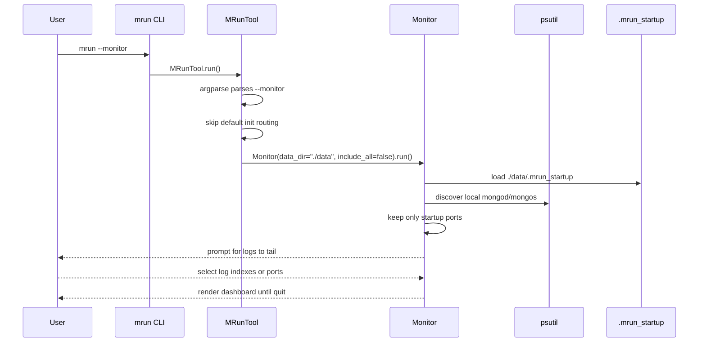
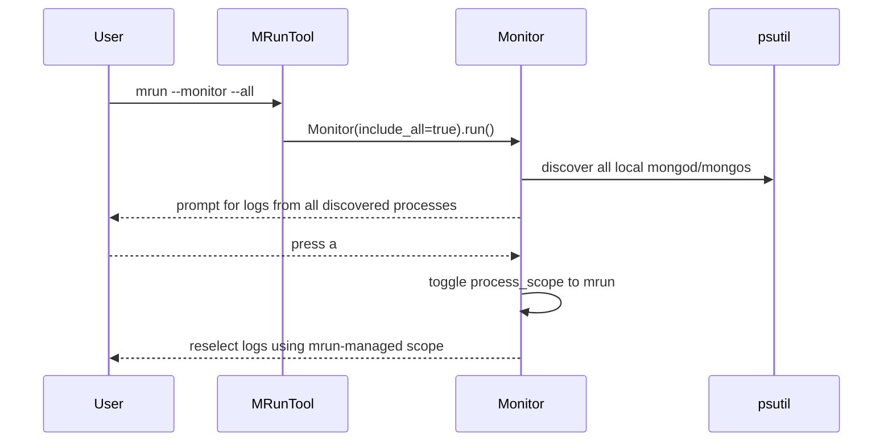
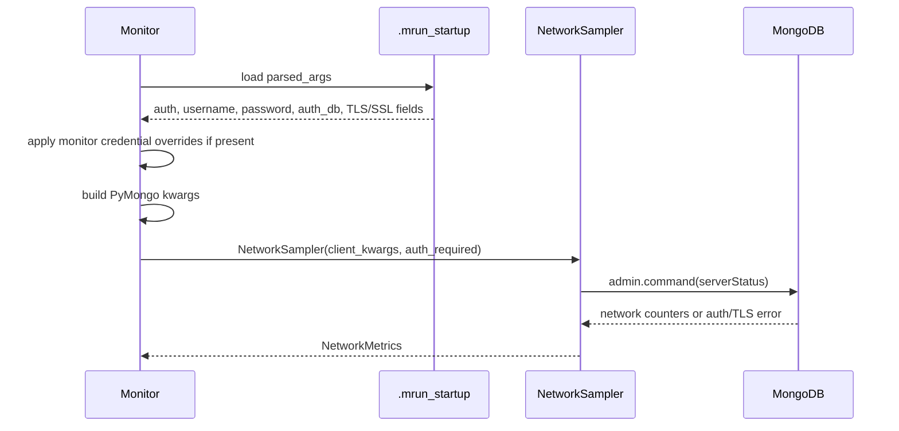
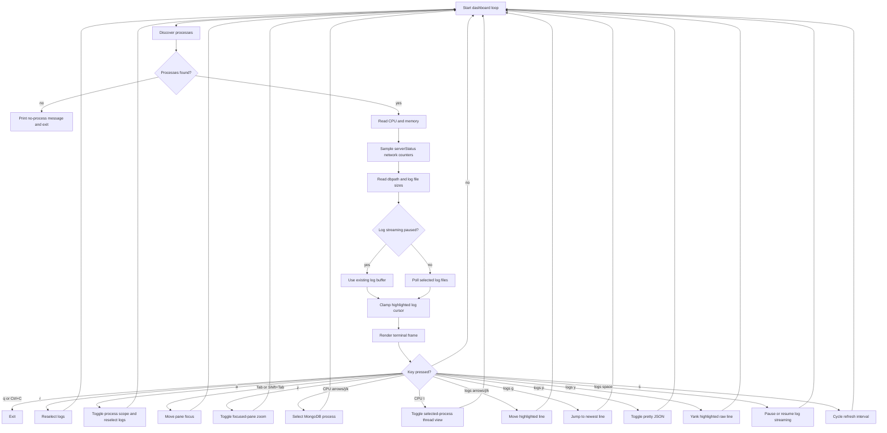
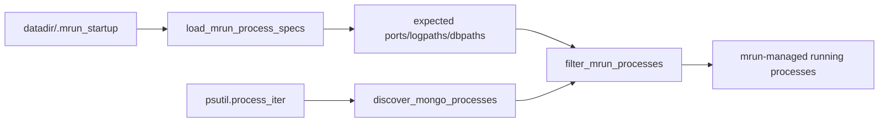
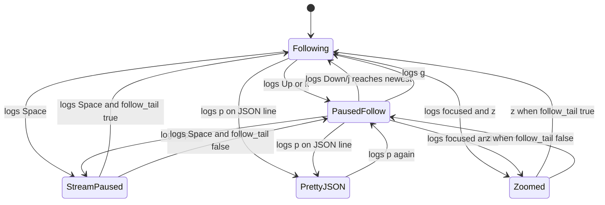

# feature-monitor branch guide

This document describes the monitor feature work introduced on the
`feature-monitor` branch. It is intended for reviewers, maintainers, and users
who want to understand how `mrun --monitor` fits into the existing mongorun
architecture.

## Feature summary

The branch adds an interactive terminal monitor for MongoDB processes launched
by mongorun. The monitor is started with:

```bash
mrun --monitor
```

By default, the monitor only displays MongoDB processes that belong to the
current mongorun data directory, using `./data/.mrun_startup` unless `--dir` is
provided. This keeps unrelated local `mongod` and `mongos` processes out of the
view.

To include every local MongoDB server process:

```bash
mrun --monitor --all
```

The monitor shows:

- CPU usage by MongoDB process.
- Memory usage by MongoDB process.
- MongoDB network counter rates from `serverStatus().network`.
- Disk consumption for each process dbpath and log file.
- Selectable live log tail with severity colors.
- Focusable panes with full-pane zoom.
- Selectable CPU process rows.
- Optional CPU thread view for the selected process.
- Zoomed log view.
- Pretty JSON view for a highlighted log line.
- Copy/yank support through OSC 52 terminal clipboard escape sequences.

No new terminal UI dependency is introduced. Rendering and keyboard input use
the Python standard library. The feature uses existing project dependencies and
interfaces such as `psutil` and the MongoDB client factory already used by
mongorun.

## Modified files

```text
feature-monitor branch
|
+-- mrun/mrun.py
|   +-- adds top-level --monitor, --all, and --dir handling
|   +-- adds --monitor-username, --monitor-password, --monitor-auth-db
|   +-- routes monitor requests before normal command dispatch
|   +-- constructs Monitor with data_dir and include_all options
|
+-- mrun/monitor.py
|   +-- new interactive monitor implementation
|   +-- process discovery, metrics sampling, log tailing, rendering, key input
|   +-- auth and TLS metadata loading for network sampling
|   +-- pane focus, focused-pane zoom, CPU process selection, thread sampling
|
+-- mrun/test/test_monitor.py
|   +-- focused tests for monitor behavior and rendering helpers
|
+-- doc/mrun.rst
|   +-- user-facing command documentation
|
+-- doc/monitor.md
|   +-- compact implementation note
|
+-- doc/feature-monitor-guide.md
    +-- this branch-level architecture and usage guide
```

## How the feature integrates

Before this branch, `MRunTool.run()` handled the normal command family:
`init`, `start`, `stop`, `restart`, `list`, and `kill`. This branch adds
`--monitor` as a top-level path that bypasses the default `init` routing.

```text
existing flow

user command
    |
    v
MRunTool.run()
    |
    +--> parse command and flags
    |
    +--> normal subcommand dispatch
         |
         +--> init/start/stop/restart/list/kill


feature-monitor flow

user command
    |
    |  mrun --monitor [--all] [--dir DIR]
    v
MRunTool.run()
    |
    +--> parse top-level monitor flags
    |
    +--> MRunTool.monitor()
         |
         +--> Monitor(...).run()
              |
              +--> interactive terminal dashboard
```

The integration is intentionally narrow:

- The existing subcommands continue to use their current code paths.
- `--monitor` is treated as a separate top-level mode.
- `--dir` is reused by monitor mode to find `.mrun_startup`.
- `--all` only affects monitor process discovery.
- `--monitor-username`, `--monitor-password`, and `--monitor-auth-db` only
  affect monitor network sampling.
- The monitor exits with status `1` when it cannot find matching processes and
  `0` for normal interactive exits.

## Invocation sequence



## All-process mode sequence



## Auth and TLS network sequence



## Runtime dashboard loop

The monitor refreshes once per configured interval. The default interval is
`1s`, and the `s` key cycles through `1s`, `5s`, and `10s`.



## Terminal layout

The monitor renders one full terminal frame. In the normal dashboard, the top
half contains CPU and memory panels. The lower-left area is split horizontally
into network and disk usage. The lower-right area is the log tail.

```text
+ [CPU Usage] ==================++ Memory Usage -----------------+
|   PORT   PID      PROCESS CPU% || PORT   PID      PROCESS  RSS  |
| > 27017  12345    mongod  12.3 || 27017  12345    mongod   1.2G |
|   27018  12346    mongod   5.1 || 27018  12346    mongod   1.1G |
+===============================++-------------------------------+
+ Network Usage ----------------++ Log Tail: 27017, 27018 -------+
| PORT   IN       OUT      REQ/s ||  27017 | {"s":"I", ...}       |
| 27017  1.5KB/s  4.0KB/s  12.0 ||  27018 | {"s":"W", ...}       |
+ Disk Usage -------------------+|> 27018 | {"s":"E", ...}       |
| PORT   DB SIZE   LOG SIZE     ||  27017 | {"s":"I", ...}       |
| 27017  540.2MB   12.1MB       ||  27018 | {"s":"D", ...}       |
+-------------------------------++-------------------------------+
status text | q/Ctrl+C quit | Tab pane | z zoom focus | ...
```

When zoom mode is active, the focused pane owns the full frame. For logs:

```text
+ [Log Tail: 27018] ==============================================+
|  27018 | {"s":"I","msg":"startup complete"}                     |
|  27018 | {"s":"W","msg":"slow operation"}                       |
|> 27018 | {"s":"E","msg":"connection failed"}                    |
|  27018 | {"s":"I","msg":"listening"}                            |
+=================================================================+
```

CPU thread view is toggled only from the CPU pane with `t`:

```text
+ [CPU Threads: port 27017 pid 12345] ============================+
| PROCESS port 27017 pid 12345 mongod                             |
| TID        CPU%    USER     SYSTEM   TOTAL                       |
| 456789      12.5   2.10     0.30     2.40                        |
+=================================================================+
```

Pretty JSON mode also uses the full log view:

```text
+ Log Tail: 27018 (Pretty JSON) ---------------------------------+
| {                                                               |
|   "t": {                                                        |
|     "$date": "2026-05-05T13:30:29.241-07:00"                   |
|   },                                                            |
|   "s": "I",                                                     |
|   "c": "NETWORK",                                               |
|   "msg": "connection accepted"                                  |
| }                                                               |
+-----------------------------------------------------------------+
```

## Process discovery

The monitor has two process scopes.

### mrun-managed scope

This is the default for `mrun --monitor`.

```text
data directory
    |
    +-- .mrun_startup
          |
          +-- startup_info
                |
                +-- port -> original mongod/mongos command line
```

`mrun/monitor.py` loads the startup file and extracts expected ports, dbpaths,
and logpaths. It then discovers running MongoDB processes using `psutil` and
keeps only processes whose ports match the startup metadata.



### All-process scope

This mode is started with `mrun --monitor --all` or by pressing `a` inside the
monitor. It skips `.mrun_startup` filtering and shows every local `mongod` or
`mongos` visible to `psutil`.

This is useful for debugging manually launched nodes, but the default remains
mrun-managed to reduce terminal noise.

## Metrics model

```text
MongoProcessInfo
|
+-- pid
+-- process name: mongod or mongos
+-- port
+-- logpath
+-- dbpath
+-- cmdline

ProcessMetrics
|
+-- cpu_percent
+-- memory_rss
+-- status

ThreadMetrics
|
+-- thread_id
+-- cpu_percent
+-- user_time
+-- system_time
+-- total_time

NetworkMetrics
|
+-- available
+-- bytes_in_per_sec
+-- bytes_out_per_sec
+-- requests_per_sec
+-- error

MonitorAuthConfig
|
+-- enabled
+-- username
+-- password
+-- auth_db
+-- initial_user
+-- client_kwargs()
+-- requires_credentials()

DiskMetrics
|
+-- available
+-- db_size
+-- log_size
+-- error
```

CPU and memory come from `psutil.Process`. Network rates are computed by
sampling MongoDB `serverStatus().network` counters and calculating deltas
between refreshes. For authenticated deployments, monitor mode loads stored
credentials from `.mrun_startup` and passes them to the network sampler. If
`--monitor-username`, `--monitor-password`, or `--monitor-auth-db` are provided,
those values override stored credentials for monitor network sampling only.
TLS/SSL client options are also rehydrated from `.mrun_startup` and passed to
the same network client path. Disk size is computed with standard library file
traversal: `os.walk()` and `os.path.getsize()`.

Thread metrics are sampled only when the CPU pane is in thread view. The
monitor reads `psutil.Process(pid).threads()` for the selected process and
computes per-thread CPU percentage from user/system time deltas between
refreshes. If the operating system denies detailed thread timing, the monitor
falls back to `psutil.Process(pid).num_threads()` and shows the thread count.

## Pane focus and CPU thread view

The monitor starts with the logs pane focused, preserving the existing behavior
where log navigation works immediately after the dashboard opens.

```text
focus order

logs --Tab--> cpu --Tab--> memory --Tab--> network --Tab--> disk --Tab--> logs
logs --Shift+Tab--> disk
```

The focused pane receives an emphasized border. `z` zooms the focused pane,
not only logs. When a zoomed pane is active, `z` returns to the quadrant view.

CPU pane behavior:

```text
default CPU pane
    |
    |  j/k or arrows
    v
selected mongod/mongos row
    |
    |  t
    v
thread view for selected process
    |
    |  t
    v
default CPU pane
```

Thread view is not rendered by default. It is a pane-local toggle, so log
tailing, memory, network, and disk views do not change unless their pane is
focused or zoomed.

macOS may deny detailed per-thread timing through `task_for_pid`, even when the
monitor is launched with `sudo`. In that case the CPU thread pane displays the
available thread count and a short unavailable message:

```text
PROCESS port 27017 pid 86094 mongod
THREAD COUNT 113
thread details unavailable
```

## Log tailing

The log tailer keeps a bounded in-memory buffer. Each line is prefixed with the
MongoDB port so users can see which process produced it.

```text
raw file line
    |
    v
LogTailer._append_line(port, line)
    |
    v
"27018 | {\"s\":\"I\", ...}"
```

The initial seed reads a small recent tail from each selected log file. Later
refreshes poll from remembered file offsets.

```mermaid
sequenceDiagram
    participant Loop as Dashboard Loop
    participant Tailer as LogTailer
    participant File as MongoDB log file

    Loop->>Tailer: read_log_stream(stream_paused=false)
    Tailer->>File: seek saved offset
    File-->>Tailer: appended lines
    Tailer->>Tailer: prefix each line with port
    Tailer-->>Loop: bounded log buffer

    Loop->>Tailer: read_log_stream(stream_paused=true)
    Tailer-->>Loop: existing buffer without reading file
```

Pausing log streaming with Space while the logs pane is focused freezes the
visible buffer and does not advance file offsets. Resuming catches up from the
same offsets.

## Log colors and highlight priority

MongoDB structured logs use the `s` field for severity. The monitor also
supports plain text fallback detection.

```text
+----------+----------------------+--------------------------+
| Severity | Detected values      | Terminal style           |
+----------+----------------------+--------------------------+
| Fatal    | F, fatal, critical   | red inverse              |
| Error    | E, error, err        | red                      |
| Warning  | W, warn, warning     | yellow                   |
| Info     | I, info              | muted teal               |
| Debug    | D, debug, trace      | dim gray                 |
+----------+----------------------+--------------------------+
```

Highlight priority is:

```text
yanked line
    |
    +-- green inverse
        |
        +-- overrides severity color

selected line
    |
    +-- inverse video over severity color
        |
        +-- keeps current row visible without losing traffic-light signal

normal line
    |
    +-- severity color only
```

The copied/yanked text is always the raw log line from the in-memory buffer. It
does not include ANSI escape sequences or visual cursor markers.

## Keyboard controls

```text
+------------+-----------------------------------------------------+
| Key        | Action                                              |
+------------+-----------------------------------------------------+
| q          | Quit monitor                                        |
| Ctrl+C     | Quit monitor                                        |
| r          | Reselect logs                                       |
| a          | Toggle mrun-managed/all process scope               |
| Tab        | Focus next pane                                     |
| Shift+Tab  | Focus previous pane                                 |
| z          | Toggle full-screen zoom for focused pane            |
| CPU Up/k   | Select previous MongoDB process                     |
| CPU Down/j | Select next MongoDB process                         |
| CPU t      | Toggle selected-process thread view                 |
| Logs Up/k  | Move highlighted log line up, pause live-follow     |
| Logs Down/j| Move highlighted log line down                      |
| Logs g     | Jump to newest log line and resume live-follow      |
| Logs p     | Pretty-print highlighted JSON log line              |
| Logs y     | Yank highlighted raw line through OSC 52            |
| Logs Space | Pause or resume log streaming                       |
| s          | Cycle refresh interval: 1s -> 5s -> 10s -> 1s       |
+------------+-----------------------------------------------------+
```

Arrow keys are parsed directly from common terminal escape sequences:

```text
CSI arrows:         ESC [ A / ESC [ B
Application arrows: ESC O A / ESC O B
Modified arrows:    ESC [ 1 ; 2 A / ESC [ 1 ; 5 B
Shift+Tab:          ESC [ Z
```

## Log interaction states



## Failure behavior

Default mrun-managed mode:

```text
No running mongorun-managed MongoDB processes found.
Start nodes with mrun first, or run: mrun --monitor --all
```

All-process mode:

```text
No running mongod or mongos processes found.
Start MongoDB nodes first, then run: mrun --monitor
```

Missing logs:

```text
27018 | log unavailable: /path/to/mongod.log
```

Unavailable network counters:

```text
PORT   IN       OUT      REQ/s   STATUS
27018  -        -        -       unavailable
```

Auth-enabled deployment without usable monitor credentials:

```text
PORT   IN       OUT      REQ/s   STATUS
27018  -        -        -       auth required
```

Restricted process-list environment:

```text
mrun --monitor could not list local processes: permission denied
```

Missing or unreadable disk paths are reported as unavailable in the disk panel,
without terminating the monitor.

## Anomaly resolution traceability

```text
+-----------------+--------+-----------------------------------+----------------+
| ID              | Source | Summary                           | Status         |
+-----------------+--------+-----------------------------------+----------------+
| FM-MON-CLI-001 | A3     | monitor flag order routing        | Implemented    |
| FM-MON-CLI-002 | A2     | monitor unknown argument handling | Implemented    |
| FM-MON-PROC-001| A4     | process-list permission handling  | Implemented    |
| FM-MON-AUTH-001| A1,A6  | load auth metadata                | Implemented    |
| FM-MON-AUTH-002| A1     | pass auth to NetworkSampler       | Implemented    |
| FM-MON-AUTH-003| A1,A6  | auth required network status      | Implemented    |
| FM-MON-AUTH-004| A2,A6  | monitor credential overrides      | Implemented    |
| FM-MON-TLS-001 | A5     | TLS/SSL network kwargs            | Implemented    |
| FM-MON-DOC-001 | all    | traceable docs                    | Implemented    |
| FM-MON-PANE-001| user   | pane focus and focused zoom       | Implemented    |
| FM-MON-CPU-001 | user   | CPU process selection             | Implemented    |
| FM-MON-CPU-002 | user   | toggled CPU thread view           | Implemented    |
| FM-MON-QA-001  | user   | final anomaly report              | Implemented    |
+-----------------+--------+-----------------------------------+----------------+
```

## Testing added by the branch

The focused monitor test module covers:

- CLI routing for `--monitor`.
- `--monitor --all` parsing.
- monitor flag order with `--all`, `--dir`, and `--no-progressbar`.
- monitor-specific rejection of init-only auth flags.
- monitor credential override flags.
- Help text for monitor controls.
- mrun-managed process filtering from `.mrun_startup`.
- all-process discovery.
- process-list permission failures.
- CPU/memory metric helpers.
- network counter deltas.
- auth metadata loading and auth-required status.
- auth/TLS client kwargs passed to network sampling.
- disk size calculation.
- log tail seeding and polling.
- stream pause/resume behavior.
- arrow escape sequence parsing.
- cursor movement and live-follow.
- `g` jump-to-latest behavior.
- `p` pretty JSON behavior.
- `y` yank behavior.
- severity color detection and rendering.
- selected/yanked color priority.
- dashboard and zoom rendering.
- pane focus cycling.
- CPU process cursor movement.
- CPU thread view is off by default.
- CPU thread view toggle.
- thread-count fallback when detailed thread timing is denied.
- CPU focused-pane zoom.
- log controls remain pane-specific.
- documentation sanity checks.

The verification commands used for this branch are:

```bash
python3 -m py_compile mrun/monitor.py mrun/mrun.py mrun/test/test_monitor.py
uv run --with pytest pytest mrun/test/test_monitor.py
uv run --with pytest pytest
```

## Review checklist

Use this list for manual review:

```text
[ ] mrun --monitor defaults to mrun-managed processes.
[ ] mrun --monitor --all shows all local mongod/mongos processes.
[ ] mrun --all --monitor routes to monitor mode.
[ ] mrun --dir data --monitor routes to monitor mode.
[ ] init-only auth flags are rejected clearly in monitor mode.
[ ] auth-enabled deployments show network rates when credentials are available.
[ ] auth-enabled deployments without credentials show auth required.
[ ] --monitor-username/--monitor-password/--monitor-auth-db override stored credentials.
[ ] a toggles process scope and prompts for log selection again.
[ ] CPU and memory panels show the expected ports and pids.
[ ] Network panel reports rates or unavailable status.
[ ] Disk panel reports dbpath and log file size.
[ ] Log tail prefixes each line with the MongoDB port.
[ ] Info logs are muted teal.
[ ] Warnings are yellow.
[ ] Errors are red.
[ ] Fatal rows are red inverse.
[ ] Selection remains visible on colored rows.
[ ] yanked rows become green inverse.
[ ] Tab and Shift+Tab cycle focus across panes.
[ ] z toggles full-screen zoom for the focused pane.
[ ] CPU pane j/k or arrows select a MongoDB process row.
[ ] CPU pane t toggles thread view for the selected process.
[ ] CPU thread view is not shown by default.
[ ] If detailed thread timing is denied, CPU thread view shows THREAD COUNT.
[ ] Log pane j/k or arrows move the highlighted log row.
[ ] p toggles pretty JSON view.
[ ] Space pauses and resumes log streaming.
[ ] g jumps back to the newest log line.
[ ] q and Ctrl+C exit cleanly.
```
