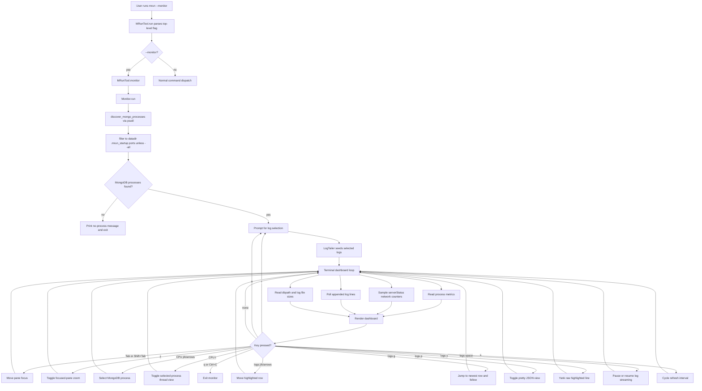
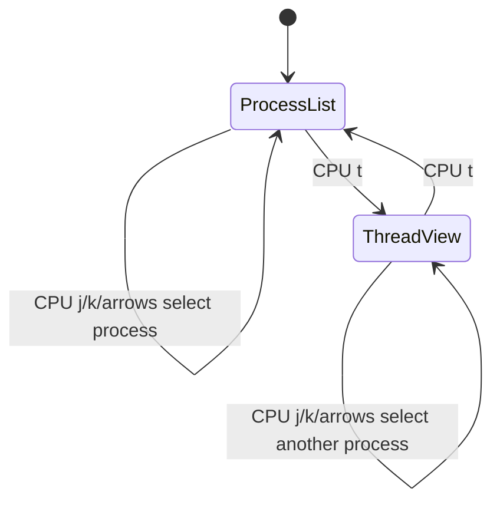

# mrun monitor implementation

This document explains how `mrun --monitor` reaches `mrun/monitor.py` and how
the monitor code is organized for review.

## Invocation path

```text
user terminal
    |
    |  mrun --monitor
    v
project script entry point
    |
    |  mrun.mrun:main()
    v
MRunTool.run()
    |
    |  argparse parses --monitor as a top-level flag
    |  default init routing is skipped for --monitor
    v
MRunTool.monitor()
    |
    |  imports Monitor lazily from mrun.monitor
    |  passes self.client as the MongoDB client factory
    v
Monitor.run()
    |
    |  discovers mrun-managed mongod/mongos processes by default
    |  asks which logs to tail
    |  enters the terminal dashboard loop
    v
terminal monitor
```

## Module responsibilities

```text
mrun/monitor.py
|
+-- process discovery
|   +-- discover_mongo_processes()
|   +-- discover_mrun_processes()
|   +-- load_mrun_process_specs()
|   +-- process_to_info()
|   +-- parses --port, --logpath, --dbpath from psutil cmdline()
|   +-- default scope is ports loaded from datadir/.mrun_startup
|
+-- process metrics
|   +-- read_process_metrics()
|   +-- reads CPU percent, RSS memory, and process status from psutil
|   +-- ThreadSampler
|   +-- samples psutil Process.threads() only when CPU thread view is toggled
|   +-- computes per-thread CPU from user/system time deltas
|   +-- falls back to Process.num_threads() when thread details are denied
|
+-- network metrics
|   +-- NetworkSampler
|   +-- calls serverStatus().network per MongoDB port
|   +-- converts counter deltas into per-second rates
|
+-- disk metrics
|   +-- read_disk_metrics()
|   +-- calculate_path_size()
|   +-- reports dbpath and logpath size using os.walk/getsize
|
+-- log tailing
|   +-- LogTailer
|   +-- seeds recent lines and polls appended bytes
|   +-- prefixes each line with its MongoDB port
|   +-- read_log_stream() freezes polling while stream pause is active
|
+-- rendering
|   +-- render_dashboard()
|   +-- make_panel()
|   +-- format_log_lines()
|   +-- detect_log_severity()
|   +-- fatal/error/warning/info/debug log rows receive severity colors
|   +-- selected log row uses inverse video over severity color
|   +-- yanked log row uses green inverse video
|   +-- DashboardSnapshot caches sampled data for fast cursor-only redraws
|
+-- keyboard control
    +-- TerminalController
    +-- q or Ctrl+C quits
    +-- r reselects logs
    +-- a toggles mrun-managed/all process scope
    +-- Tab and Shift+Tab cycle focused panes
    +-- z zooms the focused pane
    +-- CPU focus: j/k or arrows select a MongoDB process
    +-- CPU focus: t toggles process-list and selected-process thread views
    +-- logs focus: j/k or arrows move the highlighted log row
    +-- logs focus: g jumps to the newest log row and resumes live-follow
    +-- logs focus: p prettifies the highlighted row as JSON
    +-- logs focus: y yanks the highlighted raw log line with OSC 52
    +-- logs focus: space pauses or resumes log streaming
    +-- s cycles refresh through 1s, 5s, and 10s
```

## Runtime flow



## Rendering states

```text
four-panel mode

+ [CPU Usage] ---------++ Memory Usage --------+
| port pid process cpu || port pid process rss |
+----------------------++----------------------+
+ Network Usage -------++ Log Tail -----------+
| port in out req/s    ||  info log line       |  muted teal text
+ Disk Usage ----------+|  warning log line    |  yellow text
| port db size log size|| > yanked log line    |  green inverse
+----------------------++----------------------+

CPU thread mode, toggled with t while CPU is focused

+ [CPU Threads: port 27017 pid 12345] --------+
| PROCESS port 27017 pid 12345 mongod         |
| TID        CPU%    USER     SYSTEM   TOTAL   |
| 456789      12.5   2.10     0.30     2.40    |
+---------------------------------------------+

zoom mode

+ [Log Tail: 27017] ---------------------------+
|  normal log line                              |
|> selected error log line                      |  red inverse row
|> yanked log line                              |  green inverse row
+----------------------------------------------+

pretty JSON mode

+ Log Tail: 27017 (Pretty JSON) ---------------+
| {                                             |
|   "msg": "MongoDB log message",               |
|   "attr": {                                   |
|     "port": 27017                             |
|   }                                           |
| }                                             |
+----------------------------------------------+
```

The color is applied only to terminal rendering. Fatal rows use red inverse,
errors use red, warnings use yellow, info rows use muted teal, and debug rows
use dim gray. Selection uses inverse video on top of the severity color, so the
selected row remains visible without making warnings, errors, and info rows
look the same. `y` copies the raw log line, without ANSI escape sequences and
without the visual cursor marker.

## Pane focus and CPU threads

The dashboard starts with the logs pane focused so log navigation remains
immediately available. `Tab` and `Shift+Tab` cycle focus across:

```text
+-----+--------+---------+------+------+
| CPU | Memory | Network | Disk | Logs |
+-----+--------+---------+------+------+
```

The focused pane uses an emphasized ASCII border. Pressing `z` zooms that
focused pane; pressing `z` again returns to the quadrant layout.

CPU thread view is intentionally not the default. When the CPU pane is focused,
`j`/`k` or the up/down arrows select a MongoDB process row. Pressing `t`
toggles the CPU pane from the process CPU list to threads for the selected
process. Pressing `t` again returns to the process CPU list.

On macOS, detailed per-thread timing can be denied by the OS `task_for_pid`
security path even when the monitor is launched with `sudo`. In that case, the
thread pane falls back to the available thread count:

```text
PROCESS port 27017 pid 86094 mongod
THREAD COUNT 113
thread details unavailable
```



## Process scope

The default scope is mrun-managed processes. `Monitor.run()` loads
`datadir/.mrun_startup`, reads the stored startup commands, and keeps only
running `mongod` or `mongos` processes with matching ports. `mrun --monitor
--all` starts in all-process mode. Pressing `a` toggles between mrun-managed
and all detected local MongoDB processes, then prompts for log selection again.

## Tail-follow behavior

The monitor starts in live-follow mode: the highlighted row stays on the newest
log line as the log grows. When the logs pane is focused, scrolling upward with
`k` or the up arrow freezes the viewport on the selected historical line.
Scrolling downward with `j` or the down arrow resumes live-follow once the
selection reaches the newest line. The `g` key jumps directly to the newest
line and resumes live-follow.

In the logs pane, `p` parses the highlighted raw log line as JSON. If parsing
succeeds, the monitor pauses live-follow, expands the log panel, and renders
indented JSON. Pressing `p` again returns to the raw log-line view. If the line
is not valid JSON, the status footer reports the parse failure and keeps the raw
view.

In the logs pane, the spacebar pauses or resumes log streaming. Pausing does
not read from the selected log files, so the visible buffer remains frozen.
Resuming polls from the same file offsets and catches up with lines that were
written while paused.

The `s` key cycles the refresh interval:

```text
1s -> 5s -> 10s -> 1s
```

Cursor movement does not resample every metric source. The dashboard keeps a
`DashboardSnapshot` of the last process, network, disk, thread, and log sample.
Cursor-only actions redraw from that snapshot until the next refresh deadline.
This keeps log and CPU arrow-key movement responsive while preserving the
configured sampling interval.

## Failure behavior

If no mrun-managed `mongod` or `mongos` processes are discovered, the monitor
prints:

```text
No running mongorun-managed MongoDB processes found.
Start nodes with mrun first, or run: mrun --monitor --all
```

In all-process mode, if no local `mongod` or `mongos` processes are discovered,
the monitor prints:

```text
No running mongod or mongos processes found.
Start MongoDB nodes first, then run: mrun --monitor
```

If a process exists but MongoDB does not answer `serverStatus`, the network
panel marks that port as unavailable and keeps the monitor running.
