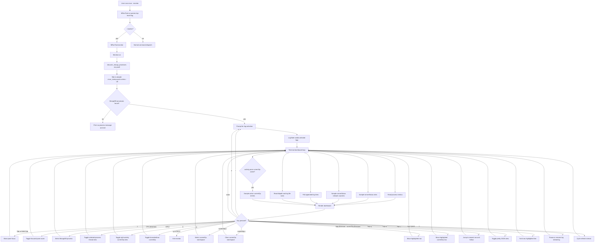
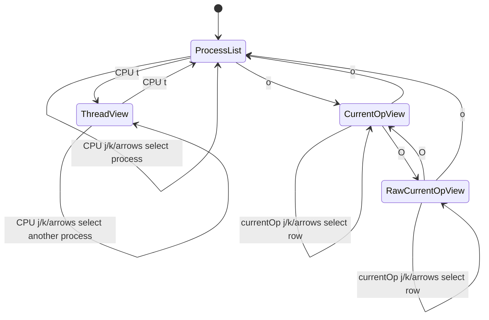

# mrun monitor implementation

This document explains how `mrun --monitor` reaches `mrun/monitor.py` and how
the monitor code is organized for review.

## Invocation path

```text
user terminal
    |
    |  mrun --monitor
    v
project script entry point
    |
    |  mrun.mrun:main()
    v
MRunTool.run()
    |
    |  argparse parses --monitor as a top-level flag
    |  default init routing is skipped for --monitor
    v
MRunTool.monitor()
    |
    |  imports Monitor lazily from mrun.monitor
    |  passes self.client as the MongoDB client factory
    v
Monitor.run()
    |
    |  discovers mrun-managed mongod/mongos processes by default
    |  asks which logs to tail
    |  enters the terminal dashboard loop
    v
terminal monitor
```

## Module responsibilities

```text
mrun/monitor.py
|
+-- process discovery
|   +-- discover_mongo_processes()
|   +-- discover_mrun_processes()
|   +-- load_mrun_process_specs()
|   +-- process_to_info()
|   +-- parses --port, --logpath, --dbpath from psutil cmdline()
|   +-- default scope is ports loaded from datadir/.mrun_startup
|
+-- process metrics
|   +-- ProcessSampler
|   +-- reads CPU percent, RSS memory, and process status from psutil
|   +-- preserves psutil.Process objects by pid so CPU percent has history
|   +-- RoleSampler
|   +-- reads serverStatus().repl role data for Primary/Secondary labels
|   +-- roles are rendered in CPU, memory, network, disk, and currentOp rows
|   +-- ThreadSampler
|   +-- samples psutil Process.threads() only when CPU thread view is toggled
|   +-- computes per-thread CPU from user/system time deltas
|   +-- falls back to Process.num_threads() when thread details are denied
|   +-- CurrentOpSampler
|   +-- samples active currentOp entries only while the activity pane shows currentOp
|   +-- passes an optional namespace filter into currentOp
|   +-- sorts active ops by secs_running and keeps the top 10
|
+-- network metrics
|   +-- NetworkSampler
|   +-- calls serverStatus().network per MongoDB port
|   +-- converts counter deltas into per-second rates
|
+-- disk metrics
|   +-- read_disk_metrics()
|   +-- calculate_path_size()
|   +-- reports dbpath and logpath size using os.walk/getsize
|
+-- log tailing
|   +-- LogTailer
|   +-- seeds recent lines and polls appended bytes
|   +-- prefixes each line with its MongoDB port
|   +-- read_log_stream() freezes polling while stream pause is active
|
+-- rendering
|   +-- render_dashboard()
|   +-- make_panel()
|   +-- left metric stack plus right log/currentOp activity pane
|   +-- neutral borders, bold pane titles, pane-colored table headers, and left-padded rows
|   +-- ANSI-aware truncation and padding so colors do not shift borders
|   +-- format_log_lines()
|   +-- log cursor has an independent viewport start and scrolls only at edges
|   +-- raw currentOp documents use BSON-safe JSON-like rendering
|   +-- detect_log_severity()
|   +-- fatal/error/warning/info/debug log rows receive severity colors
|   +-- selected log row uses inverse video over severity color
|   +-- yanked log row uses green inverse video
|   +-- pretty JSON view uses token-level syntax colors
|   +-- pretty JSON view keeps a separate scroll offset
|   +-- DashboardSnapshot caches sampled data for fast cursor-only redraws
|
+-- keyboard control
    +-- TerminalController
    +-- q or Ctrl+C quits
    +-- r reselects logs
    +-- a toggles mrun-managed/all process scope
    +-- Tab and Shift+Tab cycle focused panes
    +-- z zooms the focused pane
    +-- CPU focus: j/k or arrows select a MongoDB process
    +-- CPU focus: t toggles process-list and selected-process thread views
    +-- o toggles the right activity pane between logs and top currentOp views
    +-- O toggles formatted/raw currentOp documents while currentOp is active
    +-- n opens currentOp namespace selection while currentOp is active
    +-- currentOp c clears the active currentOp namespace filter
    +-- logs focus: j/k or arrows move the highlighted log row
    +-- currentOp activity focus: j/k or arrows move the highlighted currentOp row
    +-- Pretty JSON focus: j/k or arrows scroll expanded JSON
    +-- logs focus: g jumps to the newest log row and resumes live-follow
    +-- logs focus: p prettifies the highlighted row as JSON
    +-- logs focus: y yanks the highlighted raw log line with OSC 52
    +-- logs focus: space pauses or resumes log streaming
    +-- s cycles refresh through 1s, 5s, and 10s
```

## Runtime flow



## Rendering states

```text
dashboard mode

+ [CPU Usage] ----------++ Log Tail -------------------------+
|  PORT PID ROLE PROCESS ||  info log line                    |  muted teal text
| 27017 123 Primary ...  ||  warning log line                 |  yellow text
+ Memory Usage ---------+| > selected error log line        |  red inverse
| PORT ROLE PID RSS      ||                                  |
+ Network Usage --------+|                                  |
| PORT ROLE IN OUT REQ/s ||                                  |
+ Disk Usage -----------+|                                  |
| PORT ROLE DB LOG STATUS||                                  |
+-----------------------++----------------------------------+

CPU thread mode, toggled with t while CPU is focused

+ [CPU Threads: port 27017 pid 12345] --------+
| PROCESS port 27017 pid 12345 mongod         |
| TID        CPU%    USER     SYSTEM   TOTAL   |
| 456789      12.5   2.10     0.30     2.40    |
+---------------------------------------------+

activity-pane currentOp mode, toggled with o

+ CPU Usage -------------++ [Current Ops (Formatted)] -------+
| PORT PID ROLE PROCESS   || PORT ROLE SECS OP NS CLIENT DESC |
| 27017 123 Primary ...   ||>27017 Primary 12 query app 127.0 |
+ Memory/Network/Disk ----+| 27018 Secondary 4 command admin |
+-------------------------++----------------------------------+

raw currentOp mode, toggled with O while currentOp is active

+ CPU Usage -------------++ [Current Ops (Raw)] -------------+
| PORT PID ROLE PROCESS   || RAW CURRENTOP DOCUMENTS          |
| 27017 123 Primary ...   ||>27017 Primary {"op":"query",...} |
+-------------------------++----------------------------------+

zoom mode

+ [Log Tail: 27017] ---------------------------+
|  normal log line                              |
|> selected error log line                      |  red inverse row
|> yanked log line                              |  green inverse row
+----------------------------------------------+

pretty JSON mode

+ Log Tail: 27017 (Pretty JSON) ---------------+
| {                                             |
|   "msg": "MongoDB log message",               |
|   "attr": {                                   |
|     "port": 27017                             |
|   }                                           |
| }                                             |
+----------------------------------------------+
```

The color is applied only to terminal rendering. Fatal rows use red inverse,
errors use red, warnings use yellow, info rows use muted teal, and debug rows
use dim gray. Selection uses inverse video on top of the severity color, so the
selected row remains visible without making warnings, errors, and info rows
look the same. `y` copies the raw log line, without ANSI escape sequences and
without the visual cursor marker.

## Panel title and table-header styling

All panes are rendered through `make_panel()`. The panel renderer owns three
alignment rules:

```text
---------------- make_panel() ----------------+
| top border title: bold + pane color          |
| table header row: bold + pane color          |
| border characters: neutral terminal color    |
| non-empty content row: one leading cell      |
| clipping/padding: visible width ignores ANSI |
+----------------------------------------------+
```

The table formatters mark header rows with an internal style token before the
panel is rendered. `make_panel()` removes that token, applies the pane header
color and bold text, then clips and pads using ANSI-aware helpers. This keeps
CPU, memory, network, disk, thread, Pretty JSON, and expanded server-status
panes aligned even when the title, header, or body row contains color escapes.
The role formatter colors Primary green and Secondary/Password Required yellow
without coloring panel borders.

## Pane focus and CPU modes

The dashboard starts with the logs pane focused so log navigation remains
immediately available. `Tab` and `Shift+Tab` cycle focus across:

```text
+-----+--------+---------+------+------+
| CPU | Memory | Network | Disk | Logs |
+-----+--------+---------+------+------+
```

The focused pane uses an emphasized ASCII border. Pressing `z` zooms that
focused pane; pressing `z` again returns to the two-column dashboard layout.

CPU thread view and currentOp view are intentionally not the default. When the
CPU pane is focused, `j`/`k` or the up/down arrows select a MongoDB process row.
Pressing `t` toggles the CPU pane from the process CPU list to threads for the
selected process. Pressing `o` from any pane toggles the right activity pane
from log tail to the top 10 active currentOp entries across visible processes.
Pressing `O` while currentOp is active toggles formatted rows and raw currentOp
documents derived from `db.currentOp()`. Raw rendering is BSON-safe: ObjectId,
Timestamp, datetime, and other non-JSON values are converted to readable text
before terminal rendering. Pressing `n` while currentOp is active opens a
namespace selector built from active currentOp namespaces, and typed namespaces
are also accepted. Pressing `c` while currentOp is active clears that namespace
filter. Pressing `o` again returns the activity pane to the log tail.

All metric panes include a `ROLE` column. The monitor reads
`serverStatus().repl.stateStr` first and falls back to
`repl.isWritablePrimary`. If an authenticated deployment was created but the
monitor has no usable credentials, the role column shows `Password Required`.
Stored `.mrun_startup` credentials and explicit monitor credential overrides
are passed to role and currentOp sampling.

On macOS, detailed per-thread timing can be denied by the OS `task_for_pid`
security path even when the monitor is launched with `sudo`. In that case, the
thread pane falls back to the available thread count:

```text
PROCESS port 27017 pid 86094 mongod
THREAD COUNT 113
thread details unavailable
```



## Process scope

The default scope is mrun-managed processes. `Monitor.run()` loads
`datadir/.mrun_startup`, reads the stored startup commands, and keeps only
running `mongod` or `mongos` processes with matching ports. `mrun --monitor
--all` starts in all-process mode. Pressing `a` toggles between mrun-managed
and all detected local MongoDB processes, then prompts for log selection again.

## Tail-follow behavior

The monitor starts in live-follow mode: the highlighted row stays on the newest
log line as the log grows. When the logs pane is focused, scrolling upward with
`k` or the up arrow freezes live-follow on the selected historical line. The
cursor moves independently inside the visible log window; the text only scrolls
when the cursor reaches the visible top or bottom edge. Scrolling downward with
`j` or the down arrow resumes live-follow once the selection reaches the newest
line. The `g` key jumps directly to the newest line and resumes live-follow.

In the logs pane, `p` parses the highlighted raw log line as JSON. If parsing
succeeds, the monitor pauses live-follow, expands the log panel, and renders
indented syntax-colored JSON. Pressing `p` again returns to the raw log-line
view. If the line is not valid JSON, the status footer reports the parse failure
and keeps the raw view.

Pretty JSON keeps the existing default of opening in the zoomed log pane. While
it is active, `j`/Down and `k`/Up scroll the expanded JSON instead of moving
the selected raw log line. `p` returns to the same selected raw line, and `y`
still copies the original raw log entry.

Pretty JSON colors are applied to object keys, string values, numbers,
booleans/null, and punctuation. The monitor chooses a dark or light palette from
`COLORFGBG` when available. A user can force a palette with:

```bash
MRUN_MONITOR_THEME=dark mrun --monitor
MRUN_MONITOR_THEME=light mrun --monitor
```

In the logs pane, the spacebar pauses or resumes log streaming. Pausing does
not read from the selected log files, so the visible buffer remains frozen.
Resuming polls from the same file offsets and catches up with lines that were
written while paused.

The `s` key cycles the refresh interval:

```text
1s -> 5s -> 10s -> 1s
```

Cursor movement does not resample every metric source. The dashboard keeps a
`DashboardSnapshot` of the last process, network, disk, thread, and log sample.
Cursor-only actions redraw from that snapshot until the next refresh deadline.
This keeps log and CPU arrow-key movement responsive while preserving the
configured sampling interval.

## Failure behavior

If no mrun-managed `mongod` or `mongos` processes are discovered, the monitor
prints:

```text
No running mongorun-managed MongoDB processes found.
Start nodes with mrun first, or run: mrun --monitor --all
```

In all-process mode, if no local `mongod` or `mongos` processes are discovered,
the monitor prints:

```text
No running mongod or mongos processes found.
Start MongoDB nodes first, then run: mrun --monitor
```

If a process exists but MongoDB does not answer `serverStatus`, the network
panel marks that port as unavailable and keeps the monitor running.

If monitor auth metadata indicates credentials are required but no usable
monitor credentials are available, metric-pane `ROLE` columns show
`Password Required` and the currentOp view reports:

```text
currentOp unavailable: Password Required
```

## Fault-injection test helper

The branch also provides a local PyMongo workload helper for monitor testing:

```bash
uv run python mrun/fault_inject_collection_scans.py --dry-run
uv run python mrun/fault_inject_collection_scans.py --profile --duration 60
```

It targets `mongodb://localhost:27017/?replicaSet=rs0` by default, seeds the
dedicated `mrun_fault_injection.collection_scans` collection, and repeatedly
runs unindexed `find()` operations with the comment prefix
`mrun-monitor-fault-scan`. With `--profile`, it temporarily sets the test
database profiler to level 2 with `slowms=0`, then restores the previous
profiler setting before exiting.

Use it in a second terminal while `mrun --monitor` tails the local replica set
logs. The expected monitor signals are higher CPU/network rates on the target
port and live log rows containing `mrun-monitor-fault-scan`.
